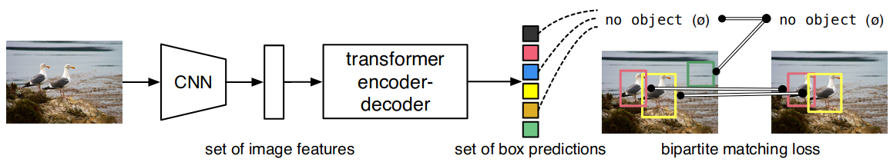
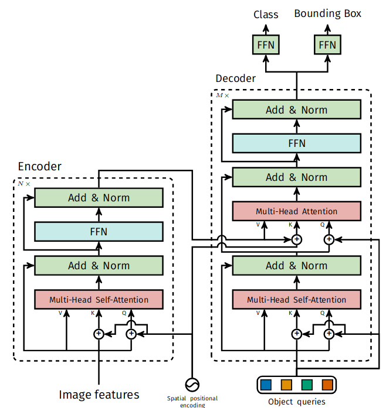

- [DETR](#detr)
  - [Backbone](#backbone)
  - [encoder+decoder](#encoderdecoder)
  - [Loss](#loss)
- [Deformable DETR](#deformable-detr)
  - [encoder+decoder](#encoderdecoder-1)
- [DETR3D](#detr3d)
  - [Highlights](#highlights)
  - [代码解析](#代码解析)
    - [总体框架：提取多层图像特征后送入head模块中进行decode](#总体框架提取多层图像特征后送入head模块中进行decode)
    - [Head](#head)
- [BevDepth](#bevdepth)


# DETR
DETR 通过将通用 CNN 与 Transformer 架构相结合，直接预测最终检测集合。在训练期间，利用二分匹配对gt和预测框进行唯一的匹配，用匹配的结果计算loss，网络pipeline如下图所示：


DETR 在通过解码器的过程中推断出一组N(固定值)个预测，其中 N被设置为明显大于图像中目标的数量。在预测对象和gt之间产生最佳二分匹配，然后优化特定对象（边界框）的损失。

详细的网络结构如下所示：

## Backbone 
Resnet50+position_encoding
位置编码公式：
$$PE(pos,2i)=sin(\frac{pos}{10000^{2i/n}})$$
$$PE(pos,2i+1)=cos(\frac{pos}{10000^{2i/n}})$$
行方向和列方向分别进行位置编码然后组合
```python

class PositionEmbeddingSine(nn.Module):
    """
    This is a more standard version of the position embedding, very similar to the one
    used by the Attention is all you need paper, generalized to work on images.
    """
    def __init__(self, num_pos_feats=64, temperature=10000, normalize=False, scale=None):
        super().__init__()
        self.num_pos_feats = num_pos_feats # 128
        self.temperature = temperature # 10000
        self.normalize = normalize # True
        scale = 2 * math.pi
        self.scale = scale

    def forward(self, tensor_list: NestedTensor):
        """
        包括tensor和mask两个成员，tensor就是输入的图像。mask跟tensor同高宽但是单通道。
        tensors:获取整个batch里面最大的w，h，用0 padding补齐（右，下padding）。
        mask:宽高与图像对应，除padding位置为true外，其他位置都为false。最后用的时候会取反，就是补全的地方是0，图像填充的地方用1
        """
        x = tensor_list.tensors # shape:[batch_size,2048,h/32,w/32]
        mask = tensor_list.mask # shape:[batch_size,h/32,w/32]
        assert mask is not None
        not_mask = ~mask
        y_embed = not_mask.cumsum(1, dtype=torch.float32) # 第“1”维的第一个不变，其余累计求和（去掉0维代表batch后可以认为是逐行的累计和），可以认为是每个点的行位置
        x_embed = not_mask.cumsum(2, dtype=torch.float32) # 第“2”维的第一个不变，其余累计求和（去掉0维代表batch后可以认为是逐列的累计和），可以认为是每个点的列位置
        
        eps = 1e-6
        y_embed = y_embed / (y_embed[:, -1:, :] + eps) * self.scale # 根据实际图形高度(因为Tensor是经过padding的，尺寸不是实际图像尺寸)进行y的归一化
        x_embed = x_embed / (x_embed[:, :, -1:] + eps) * self.scale # 根据实际图形宽度进行x的归一化

        dim_t = torch.arange(self.num_pos_feats, dtype=torch.float32, device=x.device) #（0，1，2，... 128）
        # index:(2i) = 10000^{2i/n}; (2i+1) = 10000^{2i/n} 
        # i     0                               1                               2
        # index 0               1               2               3               4
        # value 10000^(0/128)   10000^(0/128)   10000^(2/128)   10000^(2/128)   10000^(4/128)
        dim_t = self.temperature ** (2 * (dim_t // 2) / self.num_pos_feats)

        pos_x = x_embed[:, :, :, None] / dim_t # pos / (10000^{2i/n}) shape:[batch_size,h/32,w/32,num_pos_feats(128)]
        pos_y = y_embed[:, :, :, None] / dim_t 
        pos_x = torch.stack((pos_x[:, :, :, 0::2].sin(), pos_x[:, :, :, 1::2].cos()), dim=4).flatten(3) # 列方向位置编码
        pos_y = torch.stack((pos_y[:, :, :, 0::2].sin(), pos_y[:, :, :, 1::2].cos()), dim=4).flatten(3) # 行方向位置编码
        pos = torch.cat((pos_y, pos_x), dim=3).permute(0, 3, 1, 2) # shape [batch_size,128+128,h/32,w/32]
        return pos

class Backbone(BackboneBase):
    """ResNet backbone with frozen BatchNorm."""
    def __init__(self, name: str,
                 train_backbone: bool,
                 return_interm_layers: bool,
                 dilation: bool):
        backbone = getattr(torchvision.models, name)( # name = resnet50
            replace_stride_with_dilation=[False, False, dilation],
            pretrained=is_main_process(), norm_layer=FrozenBatchNorm2d)
        num_channels = 512 if name in ('resnet18', 'resnet34') else 2048 # num_channels=2048
        super().__init__(backbone, train_backbone, num_channels, return_interm_layers)


class Joiner(nn.Sequential):
    def __init__(self, backbone, position_embedding):
        super().__init__(backbone, position_embedding)

    def forward(self, tensor_list: NestedTensor):
        xs = self[0](tensor_list) # self[0]:backbone; self[1]:position_embedding; xs:[batch,2048,h/32,w/32]
        out: List[NestedTensor] = []
        pos = []
        for name, x in xs.items(): # len(xs.items()) = 1 name = '0'
            out.append(x)
            # position encoding
            pos.append(self[1](x).to(x.tensors.dtype))

        return out, pos


def build_backbone(args):
    position_embedding = build_position_encoding(args)
    train_backbone = args.lr_backbone > 0
    return_interm_layers = args.masks
    backbone = Backbone(args.backbone, train_backbone, return_interm_layers, args.dilation)
    model = Joiner(backbone, position_embedding)
    model.num_channels = backbone.num_channels
    return model

class DETR(nn.Module):
    """ This is the DETR module that performs object detection """
    def __init__(self, backbone, transformer, num_classes, num_queries, aux_loss=False):
        """ Initializes the model.
        Parameters:
            backbone: torch module of the backbone to be used. See backbone.py
            transformer: torch module of the transformer architecture. See transformer.py
            num_classes: number of object classes
            num_queries: number of object queries, ie detection slot. This is the maximal number of objects
                         DETR can detect in a single image. For COCO, we recommend 100 queries.
            aux_loss: True if auxiliary decoding losses (loss at each decoder layer) are to be used.
        """
        super().__init__()
        self.num_queries = num_queries
        self.transformer = transformer
        hidden_dim = transformer.d_model
        self.class_embed = nn.Linear(hidden_dim, num_classes + 1)
        self.bbox_embed = MLP(hidden_dim, hidden_dim, 4, 3)
        self.query_embed = nn.Embedding(num_queries, hidden_dim) # num_queries:100 hidden_dim:256
        self.input_proj = nn.Conv2d(backbone.num_channels, hidden_dim, kernel_size=1)
        self.backbone = backbone
        self.aux_loss = aux_loss

    def forward(self, samples: NestedTensor):
        """ The forward expects a NestedTensor, which consists of:
               - samples.tensor: batched images, of shape [batch_size x 3 x H x W]
               - samples.mask: a binary mask of shape [batch_size x H x W], containing 1 on padded pixels

            It returns a dict with the following elements:
               - "pred_logits": the classification logits (including no-object) for all queries.
                                Shape= [batch_size x num_queries x (num_classes + 1)]
               - "pred_boxes": The normalized boxes coordinates for all queries, represented as
                               (center_x, center_y, height, width). These values are normalized in [0, 1],
                               relative to the size of each individual image (disregarding possible padding).
                               See PostProcess for information on how to retrieve the unnormalized bounding box.
               - "aux_outputs": Optional, only returned when auxilary losses are activated. It is a list of
                                dictionnaries containing the two above keys for each decoder layer.
        """
        if isinstance(samples, (list, torch.Tensor)):
            samples = nested_tensor_from_tensor_list(samples)
        # features[0]: tensor:[batch_size,2048,h/32,w/32];mask:[batch_size,h/32,w/32]
        # pos[0]: [batch_size,128+128,h/32,w/32]
        features, pos = self.backbone(samples) #先经过backbone提取特征

        src, mask = features[-1].decompose()# src [batch_size,2048,h/32,w/32] mask [batch_size,h/32,w/32]
        assert mask is not None
        # input_proj: 1*1卷积降维，输出维度：hidden_dim(256) 
        # self.input_proj(src)后：[batch_size,256,h/32,w/32]
        # hs shape:[6, 2, 100, 256]
        # self.query_embed.weight: 100,256
        hs = self.transformer(self.input_proj(src), mask, self.query_embed.weight, pos[-1])[0]

        outputs_class = self.class_embed(hs) # [6,2,100,92(class_num)]
        outputs_coord = self.bbox_embed(hs).sigmoid() [6,2,100,4]
        out = {'pred_logits': outputs_class[-1], 'pred_boxes': outputs_coord[-1]}
        if self.aux_loss:
            out['aux_outputs'] = self._set_aux_loss(outputs_class, outputs_coord)
        return out
```
## encoder+decoder
```python
class Transformer(nn.Module):

    def __init__(self, d_model=512, nhead=8, num_encoder_layers=6,
                 num_decoder_layers=6, dim_feedforward=2048, dropout=0.1,
                 activation="relu", normalize_before=False,
                 return_intermediate_dec=False):
        super().__init__()

        encoder_layer = TransformerEncoderLayer(d_model, nhead, dim_feedforward,
                                                dropout, activation, normalize_before)
        encoder_norm = nn.LayerNorm(d_model) if normalize_before else None
        self.encoder = TransformerEncoder(encoder_layer, num_encoder_layers, encoder_norm)

        decoder_layer = TransformerDecoderLayer(d_model, nhead, dim_feedforward,
                                                dropout, activation, normalize_before)
        decoder_norm = nn.LayerNorm(d_model)
        self.decoder = TransformerDecoder(decoder_layer, num_decoder_layers, decoder_norm,
                                          return_intermediate=return_intermediate_dec)

        self._reset_parameters()

        self.d_model = d_model
        self.nhead = nhead

    def _reset_parameters(self):
        for p in self.parameters():
            if p.dim() > 1:
                nn.init.xavier_uniform_(p)

    def forward(self, src, mask, query_embed, pos_embed):
        # flatten NxCxHxW to HWxNxC
        # src [batch_size,256,h/32,w/32]
        # mask [batch_size,h/32,w/32]
        # query_embed [100, 256]
        # pos_embed [batch_size,256,h/32,w/32]
        bs, c, h, w = src.shape
        src = src.flatten(2).permute(2, 0, 1) # shape [h*w,batch_size,c(256)]

        # pos_embed.flatten(2) shape:[batch_size,c,h*w]
        pos_embed = pos_embed.flatten(2).permute(2, 0, 1) # shape [h*w,batch_size,c(256)]
        query_embed = query_embed.unsqueeze(1).repeat(1, bs, 1) # [100,2,256]
        mask = mask.flatten(1) # [batch_size, h*w]

        tgt = torch.zeros_like(query_embed) # [100,2,256]
        memory = self.encoder(src, src_key_padding_mask=mask, pos=pos_embed) # [h*w,batch_size,c(256)]
        hs = self.decoder(tgt, memory, memory_key_padding_mask=mask,
                          pos=pos_embed, query_pos=query_embed) # shape:[6,100,batch_size,c(256)]
        return hs.transpose(1, 2), memory.permute(1, 2, 0).view(bs, c, h, w)

class TransformerEncoder(nn.Module):

    def __init__(self, encoder_layer, num_layers, norm=None):
        super().__init__()
        self.layers = _get_clones(encoder_layer, num_layers)
        self.num_layers = num_layers
        self.norm = norm

    def forward(self, src,
                mask: Optional[Tensor] = None,
                src_key_padding_mask: Optional[Tensor] = None,
                pos: Optional[Tensor] = None):
        # src:[h*w,batch_size,c(256)]
        # mask:None
        # src_key_padding_mask(dataset传进来的mask) :[batch_size, h*w]
        # pos: [h*w,batch_size,c(256)]
        output = src

        for layer in self.layers:
            output = layer(output, src_mask=mask,
                           src_key_padding_mask=src_key_padding_mask, pos=pos)

        if self.norm is not None:
            output = self.norm(output)

        return output


class TransformerDecoder(nn.Module):

    def __init__(self, decoder_layer, num_layers, norm=None, return_intermediate=False):
        super().__init__()
        self.layers = _get_clones(decoder_layer, num_layers)
        self.num_layers = num_layers
        self.norm = norm
        self.return_intermediate = return_intermediate

    def forward(self, tgt, memory,
                tgt_mask: Optional[Tensor] = None,
                memory_mask: Optional[Tensor] = None,
                tgt_key_padding_mask: Optional[Tensor] = None,
                memory_key_padding_mask: Optional[Tensor] = None,
                pos: Optional[Tensor] = None,
                query_pos: Optional[Tensor] = None):
        # tgt: zeros[100,2,256] [num_quiers, batch_size, c]
        # memory: [h*w,batch_size,c(256)]
        # tgt_mask: None
        # memory_mask: None
        # tgt_key_padding_mask: None
        # memory_key_padding_mask(dataset传进来的mask): [batch_size, h*w]
        # pos: [h*w,batch_size,c(256)]
        # query_pos: [100,2,256];[num_quiers, batch_size, c]
        output = tgt

        intermediate = []

        for layer in self.layers:
            output = layer(output, memory, tgt_mask=tgt_mask,
                           memory_mask=memory_mask,
                           tgt_key_padding_mask=tgt_key_padding_mask,
                           memory_key_padding_mask=memory_key_padding_mask,
                           pos=pos, query_pos=query_pos)
            if self.return_intermediate:
                intermediate.append(self.norm(output))

        if self.norm is not None:
            output = self.norm(output)
            if self.return_intermediate:
                intermediate.pop()
                intermediate.append(output)

        if self.return_intermediate:
            return torch.stack(intermediate)

        return output.unsqueeze(0)


class TransformerEncoderLayer(nn.Module):

    def __init__(self, d_model, nhead, dim_feedforward=2048, dropout=0.1,
                 activation="relu", normalize_before=False):
        super().__init__()
        self.self_attn = nn.MultiheadAttention(d_model, nhead, dropout=dropout)
        # Implementation of Feedforward model
        self.linear1 = nn.Linear(d_model, dim_feedforward) # d_model 256 dim_feedforward 2048
        self.dropout = nn.Dropout(dropout)
        self.linear2 = nn.Linear(dim_feedforward, d_model)

        self.norm1 = nn.LayerNorm(d_model)
        self.norm2 = nn.LayerNorm(d_model)
        self.dropout1 = nn.Dropout(dropout)
        self.dropout2 = nn.Dropout(dropout)

        self.activation = _get_activation_fn(activation)
        self.normalize_before = normalize_before

    def with_pos_embed(self, tensor, pos: Optional[Tensor]):
        return tensor if pos is None else tensor + pos

    def forward_post(self,
                     src,
                     src_mask: Optional[Tensor] = None,
                     src_key_padding_mask: Optional[Tensor] = None,
                     pos: Optional[Tensor] = None):
        q = k = self.with_pos_embed(src, pos) # q = k = src+pos
        src2 = self.self_attn(q, k, value=src, attn_mask=src_mask,
                              key_padding_mask=src_key_padding_mask)[0]
        src = src + self.dropout1(src2)
        src = self.norm1(src)
        src2 = self.linear2(self.dropout(self.activation(self.linear1(src))))
        src = src + self.dropout2(src2)
        src = self.norm2(src)
        return src

    def forward(self, src,
                src_mask: Optional[Tensor] = None,
                src_key_padding_mask: Optional[Tensor] = None,
                pos: Optional[Tensor] = None):
        return self.forward_post(src, src_mask, src_key_padding_mask, pos)


class TransformerDecoderLayer(nn.Module):

    def __init__(self, d_model, nhead, dim_feedforward=2048, dropout=0.1,
                 activation="relu", normalize_before=False):
        super().__init__()
        self.self_attn = nn.MultiheadAttention(d_model, nhead, dropout=dropout)
        self.multihead_attn = nn.MultiheadAttention(d_model, nhead, dropout=dropout)
        # Implementation of Feedforward model
        self.linear1 = nn.Linear(d_model, dim_feedforward)
        self.dropout = nn.Dropout(dropout)
        self.linear2 = nn.Linear(dim_feedforward, d_model)

        self.norm1 = nn.LayerNorm(d_model)
        self.norm2 = nn.LayerNorm(d_model)
        self.norm3 = nn.LayerNorm(d_model)
        self.dropout1 = nn.Dropout(dropout)
        self.dropout2 = nn.Dropout(dropout)
        self.dropout3 = nn.Dropout(dropout)

        self.activation = _get_activation_fn(activation)
        self.normalize_before = normalize_before

    def with_pos_embed(self, tensor, pos: Optional[Tensor]):
        return tensor if pos is None else tensor + pos

    def forward_post(self, tgt, memory,
                     tgt_mask: Optional[Tensor] = None,
                     memory_mask: Optional[Tensor] = None,
                     tgt_key_padding_mask: Optional[Tensor] = None,
                     memory_key_padding_mask: Optional[Tensor] = None,
                     pos: Optional[Tensor] = None,
                     query_pos: Optional[Tensor] = None):
        """
        query_embed是个learnable embedding，训练刚开始时可以随机初始化。在训练过程中，因为需要生成不同的boxes，会被迫使变得不同来反映位置信息，所以也可以称为leant positional encoding
        """
        q = k = self.with_pos_embed(tgt, query_pos) # q = k = tgt + query_pos(query_embed)
        tgt2 = self.self_attn(q, k, value=tgt, attn_mask=tgt_mask,
                              key_padding_mask=tgt_key_padding_mask)[0]
        tgt = tgt + self.dropout1(tgt2)
        tgt = self.norm1(tgt)
        # q = tgt + query_pos
        # k = memory + pos
        # v = memory
        tgt2 = self.multihead_attn(query=self.with_pos_embed(tgt, query_pos),
                                   key=self.with_pos_embed(memory, pos),
                                   value=memory, attn_mask=memory_mask,
                                   key_padding_mask=memory_key_padding_mask)[0]
        tgt = tgt + self.dropout2(tgt2)
        tgt = self.norm2(tgt)
        tgt2 = self.linear2(self.dropout(self.activation(self.linear1(tgt))))
        tgt = tgt + self.dropout3(tgt2)
        tgt = self.norm3(tgt)
        return tgt

    def forward(self, tgt, memory,
                tgt_mask: Optional[Tensor] = None,
                memory_mask: Optional[Tensor] = None,
                tgt_key_padding_mask: Optional[Tensor] = None,
                memory_key_padding_mask: Optional[Tensor] = None,
                pos: Optional[Tensor] = None,
                query_pos: Optional[Tensor] = None):
        return self.forward_post(tgt, memory, tgt_mask, memory_mask,
                                 tgt_key_padding_mask, memory_key_padding_mask, pos, query_pos)
```

## Loss
```python
class SetCriterion(nn.Module):
    """ This class computes the loss for DETR.
    The process happens in two steps:
        1) we compute hungarian assignment between ground truth boxes and the outputs of the model
        2) we supervise each pair of matched ground-truth / prediction (supervise class and box)
    """
    def __init__(self, num_classes, matcher, weight_dict, eos_coef, losses):
        """ Create the criterion.
        Parameters:
            num_classes: number of object categories, omitting the special no-object category
            matcher: module able to compute a matching between targets and proposals
            weight_dict: dict containing as key the names of the losses and as values their relative weight.
            eos_coef: relative classification weight applied to the no-object category
            losses: list of all the losses to be applied. See get_loss for list of available losses.
        """
        super().__init__()
        self.num_classes = num_classes
        self.matcher = matcher
        self.weight_dict = weight_dict
        self.eos_coef = eos_coef
        self.losses = losses
        empty_weight = torch.ones(self.num_classes + 1)
        empty_weight[-1] = self.eos_coef
        self.register_buffer('empty_weight', empty_weight)

    def loss_labels(self, outputs, targets, indices, num_boxes, log=True):
        """Classification loss (NLL)
        targets dicts must contain the key "labels" containing a tensor of dim [nb_target_boxes]
        """
        assert 'pred_logits' in outputs
        src_logits = outputs['pred_logits']

        idx = self._get_src_permutation_idx(indices)
        target_classes_o = torch.cat([t["labels"][J] for t, (_, J) in zip(targets, indices)])
        target_classes = torch.full(src_logits.shape[:2], self.num_classes,
                                    dtype=torch.int64, device=src_logits.device)
        target_classes[idx] = target_classes_o

        loss_ce = F.cross_entropy(src_logits.transpose(1, 2), target_classes, self.empty_weight)
        losses = {'loss_ce': loss_ce}

        if log:
            # TODO this should probably be a separate loss, not hacked in this one here
            losses['class_error'] = 100 - accuracy(src_logits[idx], target_classes_o)[0]
        return losses

    @torch.no_grad()
    def loss_cardinality(self, outputs, targets, indices, num_boxes):
        """ Compute the cardinality error, ie the absolute error in the number of predicted non-empty boxes
        This is not really a loss, it is intended for logging purposes only. It doesn't propagate gradients
        """
        pred_logits = outputs['pred_logits']
        device = pred_logits.device
        tgt_lengths = torch.as_tensor([len(v["labels"]) for v in targets], device=device)
        # Count the number of predictions that are NOT "no-object" (which is the last class)
        card_pred = (pred_logits.argmax(-1) != pred_logits.shape[-1] - 1).sum(1)
        card_err = F.l1_loss(card_pred.float(), tgt_lengths.float())
        losses = {'cardinality_error': card_err}
        return losses

    def loss_boxes(self, outputs, targets, indices, num_boxes):
        """Compute the losses related to the bounding boxes, the L1 regression loss and the GIoU loss
           targets dicts must contain the key "boxes" containing a tensor of dim [nb_target_boxes, 4]
           The target boxes are expected in format (center_x, center_y, w, h), normalized by the image size.
        """
        assert 'pred_boxes' in outputs
        idx = self._get_src_permutation_idx(indices)
        src_boxes = outputs['pred_boxes'][idx]
        target_boxes = torch.cat([t['boxes'][i] for t, (_, i) in zip(targets, indices)], dim=0)

        loss_bbox = F.l1_loss(src_boxes, target_boxes, reduction='none')

        losses = {}
        losses['loss_bbox'] = loss_bbox.sum() / num_boxes

        loss_giou = 1 - torch.diag(box_ops.generalized_box_iou(
            box_ops.box_cxcywh_to_xyxy(src_boxes),
            box_ops.box_cxcywh_to_xyxy(target_boxes)))
        losses['loss_giou'] = loss_giou.sum() / num_boxes
        return losses

    def loss_masks(self, outputs, targets, indices, num_boxes):
        """Compute the losses related to the masks: the focal loss and the dice loss.
           targets dicts must contain the key "masks" containing a tensor of dim [nb_target_boxes, h, w]
        """
        assert "pred_masks" in outputs

        src_idx = self._get_src_permutation_idx(indices)
        tgt_idx = self._get_tgt_permutation_idx(indices)
        src_masks = outputs["pred_masks"]
        src_masks = src_masks[src_idx]
        masks = [t["masks"] for t in targets]
        # TODO use valid to mask invalid areas due to padding in loss
        target_masks, valid = nested_tensor_from_tensor_list(masks).decompose()
        target_masks = target_masks.to(src_masks)
        target_masks = target_masks[tgt_idx]

        # upsample predictions to the target size
        src_masks = interpolate(src_masks[:, None], size=target_masks.shape[-2:],
                                mode="bilinear", align_corners=False)
        src_masks = src_masks[:, 0].flatten(1)

        target_masks = target_masks.flatten(1)
        target_masks = target_masks.view(src_masks.shape)
        losses = {
            "loss_mask": sigmoid_focal_loss(src_masks, target_masks, num_boxes),
            "loss_dice": dice_loss(src_masks, target_masks, num_boxes),
        }
        return losses

    def _get_src_permutation_idx(self, indices):
        # permute predictions following indices
        batch_idx = torch.cat([torch.full_like(src, i) for i, (src, _) in enumerate(indices)])
        src_idx = torch.cat([src for (src, _) in indices])
        return batch_idx, src_idx

    def _get_tgt_permutation_idx(self, indices):
        # permute targets following indices
        batch_idx = torch.cat([torch.full_like(tgt, i) for i, (_, tgt) in enumerate(indices)])
        tgt_idx = torch.cat([tgt for (_, tgt) in indices])
        return batch_idx, tgt_idx

    def get_loss(self, loss, outputs, targets, indices, num_boxes, **kwargs):
        loss_map = {
            'labels': self.loss_labels,
            'cardinality': self.loss_cardinality,
            'boxes': self.loss_boxes,
            'masks': self.loss_masks
        }
        assert loss in loss_map, f'do you really want to compute {loss} loss?'
        return loss_map[loss](outputs, targets, indices, num_boxes, **kwargs)

    def forward(self, outputs, targets):
        """ This performs the loss computation.
        Parameters:
             outputs: dict of tensors, see the output specification of the model for the format
             targets: list of dicts, such that len(targets) == batch_size.
                      The expected keys in each dict depends on the losses applied, see each loss' doc
        """
        outputs_without_aux = {k: v for k, v in outputs.items() if k != 'aux_outputs'}

        # Retrieve the matching between the outputs of the last layer and the targets
        indices = self.matcher(outputs_without_aux, targets)

        # Compute the average number of target boxes accross all nodes, for normalization purposes
        num_boxes = sum(len(t["labels"]) for t in targets)
        num_boxes = torch.as_tensor([num_boxes], dtype=torch.float, device=next(iter(outputs.values())).device)
        if is_dist_avail_and_initialized():
            torch.distributed.all_reduce(num_boxes)
        num_boxes = torch.clamp(num_boxes / get_world_size(), min=1).item()

        # Compute all the requested losses
        losses = {}
        for loss in self.losses:
            losses.update(self.get_loss(loss, outputs, targets, indices, num_boxes))

        # In case of auxiliary losses, we repeat this process with the output of each intermediate layer.
        if 'aux_outputs' in outputs:
            for i, aux_outputs in enumerate(outputs['aux_outputs']):
                indices = self.matcher(aux_outputs, targets)
                for loss in self.losses:
                    if loss == 'masks':
                        # Intermediate masks losses are too costly to compute, we ignore them.
                        continue
                    kwargs = {}
                    if loss == 'labels':
                        # Logging is enabled only for the last layer
                        kwargs = {'log': False}
                    l_dict = self.get_loss(loss, aux_outputs, targets, indices, num_boxes, **kwargs)
                    l_dict = {k + f'_{i}': v for k, v in l_dict.items()}
                    losses.update(l_dict)

        return losses
```

# Deformable DETR
相比于DETR，使用了多尺度特征+scale-level embedding，用于区分不同特征层;
使用了多尺度可变形注意力替代Encoder中的selfattn和Decoder中的crossattn，减小计算量；
引入了参考点，类似引入先验知识；
设计了两阶段模式和iteraitive box refinement策略；
检测头回归分支预测是bbox相对参考点的偏移量而非绝对坐标值；\
如果是two-stage 模式下，参考点由Encoder预测topk得分最高的proposal box（这时的参考点是4d，bbox形式），然后对参考点进行position embedding来生成Decoder需要的object query和对应的query embedding；
非two-stage模式下，Decoder的 object query(target )和 query embedding 就是预设的embedding，然后将query embedding经过全连接层输出2d参考点，这时的参考点是归一化的中心坐标形式。如果是two-stage 模式下，参考点由Encoder预测topk得分最高的proposal box（这时的参考点是4d，bbox形式），然后对参考点进行position embedding来生成Decoder需要的object query和对应的query embedding；
非two-stage模式下，Decoder的 object query(target )和 query embedding 就是预设的embedding，然后将query embedding经过全连接层输出2d参考点，这时的参考点是归一化的中心坐标形式。
backbone与detr区别不大(resnet)\
简要描述：\
encoder:
1.backbone提取多尺度特征，将特征拉平，加上位置编码（每层还要加上代表当前层的可学习位置编码）作为query，拉平的特征作为value，利用输出的特征图尺寸，生成参考点
2.cross_attention，query经过一个卷积生成参考点offset(每个参考点4对offset,用来采样4个点)，query再经过另外一个卷积和softmax生成atten_wight，value经过一个卷积生成真正的value；通过参考点和offset生成采样点，在value的相应位置采样，采样的结果和atten_weight相乘求和得到一个query的encoder结果，所有query输出的结果就是memory
decoder:
1.利用可学习参数作为tgt，另外一个可学习参数作为pos_embed
2.常规的multiple_head_attention,q=k=tgt+pos_embed,v=tgt
3.cross_attention, query=tgt+pos_embed，value=encoder的memory
预测的box形式（cx,cy,w,h）
pipeline
```python
class DeformableDETR(nn.Module):
    """ This is the Deformable DETR module that performs object detection """
    def __init__(self, backbone, transformer, num_classes, num_queries, num_feature_levels,
                 aux_loss=True, with_box_refine=False, two_stage=False):
        """ Initializes the model.
        Parameters:
            backbone: torch module of the backbone to be used. See backbone.py
            transformer: torch module of the transformer architecture. See transformer.py
            num_classes: number of object classes
            num_queries: number of object queries, ie detection slot. This is the maximal number of objects
                         DETR can detect in a single image. For COCO, we recommend 100 queries.
            aux_loss: True if auxiliary decoding losses (loss at each decoder layer) are to be used.
            with_box_refine: iterative bounding box refinement
            two_stage: two-stage Deformable DETR
        """
        super().__init__()
        self.num_queries = num_queries
        self.transformer = transformer
        hidden_dim = transformer.d_model
        self.class_embed = nn.Linear(hidden_dim, num_classes)
        self.bbox_embed = MLP(hidden_dim, hidden_dim, 4, 3)
        self.num_feature_levels = num_feature_levels
        self.query_embed = nn.Embedding(num_queries, hidden_dim*2) # 300,256*2
        if num_feature_levels > 1:
            num_backbone_outs = len(backbone.strides)
            input_proj_list = []
            for _ in range(num_backbone_outs):
                in_channels = backbone.num_channels[_]
                input_proj_list.append(nn.Sequential(
                    nn.Conv2d(in_channels, hidden_dim, kernel_size=1),
                    nn.GroupNorm(32, hidden_dim),
                ))
            for _ in range(num_feature_levels - num_backbone_outs):
                input_proj_list.append(nn.Sequential(
                    nn.Conv2d(in_channels, hidden_dim, kernel_size=3, stride=2, padding=1),
                    nn.GroupNorm(32, hidden_dim),
                ))
                in_channels = hidden_dim
            self.input_proj = nn.ModuleList(input_proj_list)
        else:
            self.input_proj = nn.ModuleList([
                nn.Sequential(
                    nn.Conv2d(backbone.num_channels[0], hidden_dim, kernel_size=1),
                    nn.GroupNorm(32, hidden_dim),
                )])
        self.backbone = backbone
        self.aux_loss = aux_loss
        self.with_box_refine = with_box_refine
        self.two_stage = two_stage

        prior_prob = 0.01
        bias_value = -math.log((1 - prior_prob) / prior_prob)
        self.class_embed.bias.data = torch.ones(num_classes) * bias_value
        nn.init.constant_(self.bbox_embed.layers[-1].weight.data, 0)
        nn.init.constant_(self.bbox_embed.layers[-1].bias.data, 0)
        for proj in self.input_proj:
            nn.init.xavier_uniform_(proj[0].weight, gain=1)
            nn.init.constant_(proj[0].bias, 0)

        # if two-stage, the last class_embed and bbox_embed is for region proposal generation
        num_pred = (transformer.decoder.num_layers + 1) if two_stage else transformer.decoder.num_layers
        if with_box_refine:
            self.class_embed = _get_clones(self.class_embed, num_pred)
            self.bbox_embed = _get_clones(self.bbox_embed, num_pred)
            nn.init.constant_(self.bbox_embed[0].layers[-1].bias.data[2:], -2.0)
            # hack implementation for iterative bounding box refinement
            self.transformer.decoder.bbox_embed = self.bbox_embed
        else:
            nn.init.constant_(self.bbox_embed.layers[-1].bias.data[2:], -2.0)
            self.class_embed = nn.ModuleList([self.class_embed for _ in range(num_pred)])
            self.bbox_embed = nn.ModuleList([self.bbox_embed for _ in range(num_pred)])
            self.transformer.decoder.bbox_embed = None
        if two_stage:
            # hack implementation for two-stage
            self.transformer.decoder.class_embed = self.class_embed
            for box_embed in self.bbox_embed:
                nn.init.constant_(box_embed.layers[-1].bias.data[2:], 0.0)

    def forward(self, samples: NestedTensor):
        """ The forward expects a NestedTensor, which consists of:
               - samples.tensor: batched images, of shape [batch_size x 3 x H x W]
               - samples.mask: a binary mask of shape [batch_size x H x W], containing 1 on padded pixels

            It returns a dict with the following elements:
               - "pred_logits": the classification logits (including no-object) for all queries.
                                Shape= [batch_size x num_queries x (num_classes + 1)]
               - "pred_boxes": The normalized boxes coordinates for all queries, represented as
                               (center_x, center_y, height, width). These values are normalized in [0, 1],
                               relative to the size of each individual image (disregarding possible padding).
                               See PostProcess for information on how to retrieve the unnormalized bounding box.
               - "aux_outputs": Optional, only returned when auxilary losses are activated. It is a list of
                                dictionnaries containing the two above keys for each decoder layer.
        """
        if not isinstance(samples, NestedTensor):
            samples = nested_tensor_from_tensor_list(samples)
        # features:list pos:list,代表多尺度图像特征（跟detr不一样，detr只有单尺度）
        # features[0]:[bs,512,h/8,w/8];features[1]:[bs,1024,h/16,w/16];features[0]:[bs,2048,h/32,w/32]
        # pos[0]:[bs,256,h/8,w/8];pos[1]:[bs,256,h/16,w/16];pos[0]:[bs,256,h/32,w/32] 位置编码
        features, pos = self.backbone(samples) # backbone提取图像特征，输出位置编码

        srcs = []
        masks = []
        for l, feat in enumerate(features):
            src, mask = feat.decompose()
            srcs.append(self.input_proj[l](src))
            masks.append(mask)
            assert mask is not None
        if self.num_feature_levels > len(srcs):
            _len_srcs = len(srcs)
            for l in range(_len_srcs, self.num_feature_levels):
                if l == _len_srcs:
                    src = self.input_proj[l](features[-1].tensors)
                else:
                    src = self.input_proj[l](srcs[-1])
                m = samples.mask
                mask = F.interpolate(m[None].float(), size=src.shape[-2:]).to(torch.bool)[0]
                pos_l = self.backbone[1](NestedTensor(src, mask)).to(src.dtype)
                srcs.append(src)
                masks.append(mask)
                pos.append(pos_l)
        
        query_embeds = self.query_embed.weight #[300,512]
        
        """
        src: 列表 [2(bs),256(hidden_dim),h/8,w/8],[2,256,h/16,w/16],[2,256,h/32,w/32]
        masks: 列表 [2(bs),h/8,w/8],[2(bs),h/16,w/16],[2(bs),h/32,w/32]
        pos: 列表 [2(bs),256(hidden_dim),h/8,w/8],[2,256,h/16,w/16],[2,256,h/32,w/32]
        query_embeds: [300,256*2]
        """
        hs, init_reference, inter_references, enc_outputs_class, enc_outputs_coord_unact = self.transformer(srcs, masks, pos, query_embeds) # 跳转到DeformableTransformer 的forward
        """
        hs: [6(transformer_layer),2(bs),300,256]
        init_reference: [2,300,2]，query_embeds分裂出的一半经过Conv学习到的参考点
        inter_references: [6,2(bs),300,2]
        enc_outputs_class: none
        enc_outputs_coord_unact: none
        """

        outputs_classes = []
        outputs_coords = []
        for lvl in range(hs.shape[0]):
            if lvl == 0:
                reference = init_reference
            else:
                reference = inter_references[lvl - 1] # 非第0层的时候取中间层结果
            reference = inverse_sigmoid(reference) # 预测box参考点
            outputs_class = self.class_embed[lvl](hs[lvl]) # 对hs的每一层预测class
            tmp = self.bbox_embed[lvl](hs[lvl]) # 对hs的每一层预测box的偏移值
            if reference.shape[-1] == 4:
                tmp += reference
            else:
                assert reference.shape[-1] == 2
                tmp[..., :2] += reference # 参考点加偏移值就是最后的box
            outputs_coord = tmp.sigmoid()
            outputs_classes.append(outputs_class)
            outputs_coords.append(outputs_coord)
        outputs_class = torch.stack(outputs_classes)
        outputs_coord = torch.stack(outputs_coords)

        out = {'pred_logits': outputs_class[-1], 'pred_boxes': outputs_coord[-1]} # 虽然有6层transformer，但是只要最后一层的结果
        if self.aux_loss:
            out['aux_outputs'] = self._set_aux_loss(outputs_class, outputs_coord)

        if self.two_stage:
            enc_outputs_coord = enc_outputs_coord_unact.sigmoid()
            out['enc_outputs'] = {'pred_logits': enc_outputs_class, 'pred_boxes': enc_outputs_coord}
        return out

    @torch.jit.unused
    def _set_aux_loss(self, outputs_class, outputs_coord):
        # this is a workaround to make torchscript happy, as torchscript
        # doesn't support dictionary with non-homogeneous values, such
        # as a dict having both a Tensor and a list.
        return [{'pred_logits': a, 'pred_boxes': b}
                for a, b in zip(outputs_class[:-1], outputs_coord[:-1])]
```
## encoder+decoder
```python
class DeformableTransformer(nn.Module):
    def __init__(self, d_model=256, nhead=8,
                 num_encoder_layers=6, num_decoder_layers=6, dim_feedforward=1024, dropout=0.1,
                 activation="relu", return_intermediate_dec=False,
                 num_feature_levels=4, dec_n_points=4,  enc_n_points=4,
                 two_stage=False, two_stage_num_proposals=300):
        super().__init__()

        self.d_model = d_model
        self.nhead = nhead
        self.two_stage = two_stage
        self.two_stage_num_proposals = two_stage_num_proposals

        encoder_layer = DeformableTransformerEncoderLayer(d_model, dim_feedforward,
                                                          dropout, activation,
                                                          num_feature_levels, nhead, enc_n_points)
        self.encoder = DeformableTransformerEncoder(encoder_layer, num_encoder_layers)

        decoder_layer = DeformableTransformerDecoderLayer(d_model, dim_feedforward,
                                                          dropout, activation,
                                                          num_feature_levels, nhead, dec_n_points)
        self.decoder = DeformableTransformerDecoder(decoder_layer, num_decoder_layers, return_intermediate_dec)

        self.level_embed = nn.Parameter(torch.Tensor(num_feature_levels, d_model))

        if two_stage:
            self.enc_output = nn.Linear(d_model, d_model)
            self.enc_output_norm = nn.LayerNorm(d_model)
            self.pos_trans = nn.Linear(d_model * 2, d_model * 2)
            self.pos_trans_norm = nn.LayerNorm(d_model * 2)
        else:
            self.reference_points = nn.Linear(d_model, 2)

        self._reset_parameters()

    def _reset_parameters(self):
        for p in self.parameters():
            if p.dim() > 1:
                nn.init.xavier_uniform_(p)
        for m in self.modules():
            if isinstance(m, MSDeformAttn):
                m._reset_parameters()
        if not self.two_stage:
            xavier_uniform_(self.reference_points.weight.data, gain=1.0)
            constant_(self.reference_points.bias.data, 0.)
        normal_(self.level_embed)

    def get_proposal_pos_embed(self, proposals):
        num_pos_feats = 128
        temperature = 10000
        scale = 2 * math.pi

        dim_t = torch.arange(num_pos_feats, dtype=torch.float32, device=proposals.device)
        dim_t = temperature ** (2 * (dim_t // 2) / num_pos_feats)
        # N, L, 4
        proposals = proposals.sigmoid() * scale
        # N, L, 4, 128
        pos = proposals[:, :, :, None] / dim_t
        # N, L, 4, 64, 2
        pos = torch.stack((pos[:, :, :, 0::2].sin(), pos[:, :, :, 1::2].cos()), dim=4).flatten(2)
        return pos

    def gen_encoder_output_proposals(self, memory, memory_padding_mask, spatial_shapes):
        N_, S_, C_ = memory.shape
        base_scale = 4.0
        proposals = []
        _cur = 0
        for lvl, (H_, W_) in enumerate(spatial_shapes):
            mask_flatten_ = memory_padding_mask[:, _cur:(_cur + H_ * W_)].view(N_, H_, W_, 1)
            valid_H = torch.sum(~mask_flatten_[:, :, 0, 0], 1)
            valid_W = torch.sum(~mask_flatten_[:, 0, :, 0], 1)

            grid_y, grid_x = torch.meshgrid(torch.linspace(0, H_ - 1, H_, dtype=torch.float32, device=memory.device),
                                            torch.linspace(0, W_ - 1, W_, dtype=torch.float32, device=memory.device))
            grid = torch.cat([grid_x.unsqueeze(-1), grid_y.unsqueeze(-1)], -1)

            scale = torch.cat([valid_W.unsqueeze(-1), valid_H.unsqueeze(-1)], 1).view(N_, 1, 1, 2)
            grid = (grid.unsqueeze(0).expand(N_, -1, -1, -1) + 0.5) / scale
            wh = torch.ones_like(grid) * 0.05 * (2.0 ** lvl)
            proposal = torch.cat((grid, wh), -1).view(N_, -1, 4)
            proposals.append(proposal)
            _cur += (H_ * W_)
        output_proposals = torch.cat(proposals, 1)
        output_proposals_valid = ((output_proposals > 0.01) & (output_proposals < 0.99)).all(-1, keepdim=True)
        output_proposals = torch.log(output_proposals / (1 - output_proposals))
        output_proposals = output_proposals.masked_fill(memory_padding_mask.unsqueeze(-1), float('inf'))
        output_proposals = output_proposals.masked_fill(~output_proposals_valid, float('inf'))

        output_memory = memory
        output_memory = output_memory.masked_fill(memory_padding_mask.unsqueeze(-1), float(0))
        output_memory = output_memory.masked_fill(~output_proposals_valid, float(0))
        output_memory = self.enc_output_norm(self.enc_output(output_memory))
        return output_memory, output_proposals

    def get_valid_ratio(self, mask):
        _, H, W = mask.shape
        valid_H = torch.sum(~mask[:, :, 0], 1)
        valid_W = torch.sum(~mask[:, 0, :], 1)
        valid_ratio_h = valid_H.float() / H
        valid_ratio_w = valid_W.float() / W
        valid_ratio = torch.stack([valid_ratio_w, valid_ratio_h], -1)
        return valid_ratio

    def forward(self, srcs, masks, pos_embeds, query_embed=None):
        assert self.two_stage or query_embed is not None
        """
        src: 列表 [2(bs),256(hidden_dim),h/8,w/8],[2,256,h/16,w/16],[2,256,h/32,w/32]
        masks: 列表 [2(bs),h/8,w/8],[2(bs),h/16,w/16],[2(bs),h/32,w/32]
        pos_embeds: 位置编码，列表 [2(bs),256(hidden_dim),h/8,w/8],[2,256,h/16,w/16],[2,256,h/32,w/32]
        query_embeds: [300,256*2]
        """

        # prepare input for encoder
        src_flatten = []
        mask_flatten = []
        lvl_pos_embed_flatten = []
        spatial_shapes = []
        for lvl, (src, mask, pos_embed) in enumerate(zip(srcs, masks, pos_embeds)):
            bs, c, h, w = src.shape
            spatial_shape = (h, w)
            spatial_shapes.append(spatial_shape)
            src = src.flatten(2).transpose(1, 2)
            mask = mask.flatten(1)
            pos_embed = pos_embed.flatten(2).transpose(1, 2)
            #level_embed:[3,256],3个特征层分别附加d_model维度的embedding，用于区分query对应的具体特征层
            lvl_pos_embed = pos_embed + self.level_embed[lvl].view(1, 1, -1)
            lvl_pos_embed_flatten.append(lvl_pos_embed)
            src_flatten.append(src)
            mask_flatten.append(mask)
        src_flatten = torch.cat(src_flatten, 1) #[bs,三层h*w,256]
        mask_flatten = torch.cat(mask_flatten, 1)#[bs,三层h*w,256]
        lvl_pos_embed_flatten = torch.cat(lvl_pos_embed_flatten, 1)#[bs,三层h*w,256]
        spatial_shapes = torch.as_tensor(spatial_shapes, dtype=torch.long, device=src_flatten.device)

        #level_start_index 每层seq的开始序号[0,  8448, 10560] 用于后面可变形辅助计算
        level_start_index = torch.cat((spatial_shapes.new_zeros((1, )), spatial_shapes.prod(1).cumsum(0)[:-1]))
        valid_ratios = torch.stack([self.get_valid_ratio(m) for m in masks], 1) # 有效区域比例（训练时图像缩放后放到一个mask图中，所以用于训练的图中只有部分是有效区域），shape:[bs,3,2]

        # encoder
        memory = self.encoder(src_flatten, spatial_shapes, level_start_index, valid_ratios, lvl_pos_embed_flatten, mask_flatten) # 跳转到DeformableTransformerEncoder out:[bs,seq_len,256]

        # prepare input for decoder
        bs, _, c = memory.shape
        
        query_embed, tgt = torch.split(query_embed, c, dim=1)#query_embed: [300,256] tgt: [300,256]
        query_embed = query_embed.unsqueeze(0).expand(bs, -1, -1) # [bs,300,256]
        tgt = tgt.unsqueeze(0).expand(bs, -1, -1) # [bs,300,256]
        reference_points = self.reference_points(query_embed).sigmoid()# self.reference_points Conv(256,2) out: [bs,300,2],直接根据query_embed学习参考点坐标
        init_reference_out = reference_points

        # decoder
        hs, inter_references = self.decoder(tgt, reference_points, memory,# 跳转到 DeformableTransformerDecoder
                                            spatial_shapes, level_start_index, valid_ratios, query_embed, mask_flatten)

        inter_references_out = inter_references
        if self.two_stage:
            return hs, init_reference_out, inter_references_out, enc_outputs_class, enc_outputs_coord_unact
        return hs, init_reference_out, inter_references_out, None, None


class DeformableTransformerEncoderLayer(nn.Module):
    def __init__(self,
                 d_model=256, d_ffn=1024,
                 dropout=0.1, activation="relu",
                 n_levels=4, n_heads=8, n_points=4):
        super().__init__()

        # self attention
        self.self_attn = MSDeformAttn(d_model, n_levels, n_heads, n_points)
        self.dropout1 = nn.Dropout(dropout)
        self.norm1 = nn.LayerNorm(d_model)

        # ffn
        self.linear1 = nn.Linear(d_model, d_ffn)
        self.activation = _get_activation_fn(activation)
        self.dropout2 = nn.Dropout(dropout)
        self.linear2 = nn.Linear(d_ffn, d_model)
        self.dropout3 = nn.Dropout(dropout)
        self.norm2 = nn.LayerNorm(d_model)

    @staticmethod
    def with_pos_embed(tensor, pos):
        return tensor if pos is None else tensor + pos

    def forward_ffn(self, src):
        src2 = self.linear2(self.dropout2(self.activation(self.linear1(src))))
        src = src + self.dropout3(src2)
        src = self.norm2(src)
        return src

    def forward(self, src, pos, reference_points, spatial_shapes, level_start_index, padding_mask=None):
        # self attention
        """
        src: [bs,三层h*w,256]
        pos: [bs,三层h*w,256] backbone传出的位置编码加上每层的可学习位置编码
        """
        src2 = self.self_attn(self.with_pos_embed(src, pos), reference_points, src, spatial_shapes, level_start_index, padding_mask)# 跳转到MSDeformAttn
        src = src + self.dropout1(src2)
        src = self.norm1(src)

        # ffn
        src = self.forward_ffn(src)

        return src


class DeformableTransformerEncoder(nn.Module):
    def __init__(self, encoder_layer, num_layers):
        super().__init__()
        self.layers = _get_clones(encoder_layer, num_layers)
        self.num_layers = num_layers

    @staticmethod
    def get_reference_points(spatial_shapes, valid_ratios, device):
        reference_points_list = []
        for lvl, (H_, W_) in enumerate(spatial_shapes):

            ref_y, ref_x = torch.meshgrid(torch.linspace(0.5, H_ - 0.5, H_, dtype=torch.float32, device=device),
                                          torch.linspace(0.5, W_ - 0.5, W_, dtype=torch.float32, device=device))
            ref_y = ref_y.reshape(-1)[None] / (valid_ratios[:, None, lvl, 1] * H_)
            ref_x = ref_x.reshape(-1)[None] / (valid_ratios[:, None, lvl, 0] * W_)
            ref = torch.stack((ref_x, ref_y), -1)
            reference_points_list.append(ref)
        reference_points = torch.cat(reference_points_list, 1)
        reference_points = reference_points[:, :, None] * valid_ratios[:, None]
        return reference_points

    def forward(self, src, spatial_shapes, level_start_index, valid_ratios, pos=None, padding_mask=None):
        """
        src: [bs,三层h*w,256]
        pos: [bs,三层h*w,256] backbone传出的位置编码加上每层的可学习位置编码
        """
        output = src
        # reference_points: [bs,3层h*w, 3, 2]
        reference_points = self.get_reference_points(spatial_shapes, valid_ratios, device=src.device)
        for _, layer in enumerate(self.layers):
            output = layer(output, pos, reference_points, spatial_shapes, level_start_index, padding_mask)

        return output


class DeformableTransformerDecoderLayer(nn.Module):
    def __init__(self, d_model=256, d_ffn=1024,
                 dropout=0.1, activation="relu",
                 n_levels=4, n_heads=8, n_points=4):
        super().__init__()

        # cross attention
        self.cross_attn = MSDeformAttn(d_model, n_levels, n_heads, n_points)
        self.dropout1 = nn.Dropout(dropout)
        self.norm1 = nn.LayerNorm(d_model)

        # self attention
        self.self_attn = nn.MultiheadAttention(d_model, n_heads, dropout=dropout)
        self.dropout2 = nn.Dropout(dropout)
        self.norm2 = nn.LayerNorm(d_model)

        # ffn
        self.linear1 = nn.Linear(d_model, d_ffn)
        self.activation = _get_activation_fn(activation)
        self.dropout3 = nn.Dropout(dropout)
        self.linear2 = nn.Linear(d_ffn, d_model)
        self.dropout4 = nn.Dropout(dropout)
        self.norm3 = nn.LayerNorm(d_model)

    @staticmethod
    def with_pos_embed(tensor, pos):
        return tensor if pos is None else tensor + pos

    def forward_ffn(self, tgt):
        tgt2 = self.linear2(self.dropout3(self.activation(self.linear1(tgt))))
        tgt = tgt + self.dropout4(tgt2)
        tgt = self.norm3(tgt)
        return tgt

    def forward(self, tgt, query_pos, reference_points, src, src_spatial_shapes, level_start_index, src_padding_mask=None):
        # self attention
        q = k = self.with_pos_embed(tgt, query_pos)
        tgt2 = self.self_attn(q.transpose(0, 1), k.transpose(0, 1), tgt.transpose(0, 1))[0].transpose(0, 1)
        tgt = tgt + self.dropout2(tgt2)
        tgt = self.norm2(tgt)

        # cross attention
        tgt2 = self.cross_attn(self.with_pos_embed(tgt, query_pos),
                               reference_points,
                               src, src_spatial_shapes, level_start_index, src_padding_mask)
        tgt = tgt + self.dropout1(tgt2)
        tgt = self.norm1(tgt)

        # ffn
        tgt = self.forward_ffn(tgt)

        return tgt


class DeformableTransformerDecoder(nn.Module):
    def __init__(self, decoder_layer, num_layers, return_intermediate=False):
        super().__init__()
        self.layers = _get_clones(decoder_layer, num_layers)
        self.num_layers = num_layers
        self.return_intermediate = return_intermediate
        # hack implementation for iterative bounding box refinement and two-stage Deformable DETR
        self.bbox_embed = None
        self.class_embed = None

    def forward(self, tgt, reference_points, src, src_spatial_shapes, src_level_start_index, src_valid_ratios,
                query_pos=None, src_padding_mask=None):
        output = tgt

        intermediate = []
        intermediate_reference_points = []
        for lid, layer in enumerate(self.layers):
            
            reference_points_input = reference_points[:, :, None] * src_valid_ratios[:, None]
            
            output = layer(output, query_pos, reference_points_input, src, src_spatial_shapes, src_level_start_index, src_padding_mask)

            if self.return_intermediate:
                intermediate.append(output)
                intermediate_reference_points.append(reference_points)

        if self.return_intermediate:
            return torch.stack(intermediate), torch.stack(intermediate_reference_points)

        return output, reference_points

class MSDeformAttn(nn.Module):
    def __init__(self, d_model=256, n_levels=4, n_heads=8, n_points=4):
        super().__init__()
        if d_model % n_heads != 0:
            raise ValueError('d_model must be divisible by n_heads, but got {} and {}'.format(d_model, n_heads))
        _d_per_head = d_model // n_heads
        # you'd better set _d_per_head to a power of 2 which is more efficient in our CUDA implementation
        if not _is_power_of_2(_d_per_head):
            warnings.warn("You'd better set d_model in MSDeformAttn to make the dimension of each attention head a power of 2 "
                          "which is more efficient in our CUDA implementation.")

        self.im2col_step = 64

        self.d_model = d_model
        self.n_levels = n_levels
        self.n_heads = n_heads
        self.n_points = n_points

        self.sampling_offsets = nn.Linear(d_model, n_heads * n_levels * n_points * 2) # [256,8*3*4*2] 对query对应的每个点预测四个offset点
        self.attention_weights = nn.Linear(d_model, n_heads * n_levels * n_points)
        self.value_proj = nn.Linear(d_model, d_model)
        self.output_proj = nn.Linear(d_model, d_model)

        self._reset_parameters()

    def forward(self, query, reference_points, input_flatten, input_spatial_shapes, input_level_start_index, input_padding_mask=None):
        """
        :param query                       (N, Length_{query}, C)
        :param reference_points            (N, Length_{query}, n_levels, 2), range in [0, 1], top-left (0,0), bottom-right (1, 1), including padding area
                                        or (N, Length_{query}, n_levels, 4), add additional (w, h) to form reference boxes
        :param input_flatten               (N, \sum_{l=0}^{L-1} H_l \cdot W_l, C)
        :param input_spatial_shapes        (n_levels, 2), [(H_0, W_0), (H_1, W_1), ..., (H_{L-1}, W_{L-1})]
        :param input_level_start_index     (n_levels, ), [0, H_0*W_0, H_0*W_0+H_1*W_1, H_0*W_0+H_1*W_1+H_2*W_2, ..., H_0*W_0+H_1*W_1+...+H_{L-1}*W_{L-1}]
        :param input_padding_mask          (N, \sum_{l=0}^{L-1} H_l \cdot W_l), True for padding elements, False for non-padding elements

        :return output                     (N, Length_{query}, C)
        总的思想：query预测点的offset和wight，offset加reference后对input_flatten进行采样，采样结果和weight加权得到输出
        """
        N, Len_q, _ = query.shape # query [bs,seq_len,256] seq_len等于三层h*w (由图像特征加位置编码得来)，与传统attenion不同，这里是用于预测点的offset和wight
        N, Len_in, _ = input_flatten.shape # input_flatten [bs,seq_len,256] seq_len等于三层h*w （图像特征）

        value = self.value_proj(input_flatten)# self.value_proj Conv(256,256)
        if input_padding_mask is not None:
            value = value.masked_fill(input_padding_mask[..., None], float(0))
        value = value.view(N, Len_in, self.n_heads, self.d_model // self.n_heads)#[bs,seq_len,8,32]
        # self.sampling_offsets Conv(256,192)
        sampling_offsets = self.sampling_offsets(query).view(N, Len_q, self.n_heads, self.n_levels, self.n_points, 2)#[bs,seq_len,8,3,4,2]
        attention_weights = self.attention_weights(query).view(N, Len_q, self.n_heads, self.n_levels * self.n_points)#[bs,seq_len,8,12]
        attention_weights = F.softmax(attention_weights, -1).view(N, Len_q, self.n_heads, self.n_levels, self.n_points)#[bs,seq_len,8,3,4]
        # N, Len_q, n_heads, n_levels, n_points, 2
        
        offset_normalizer = torch.stack([input_spatial_shapes[..., 1], input_spatial_shapes[..., 0]], -1)
        sampling_locations = reference_points[:, :, None, :, None, :] \
                                + sampling_offsets / offset_normalizer[None, None, None, :, None, :]#[bs,seq_len,8,3,4,2]
        output = MSDeformAttnFunction.apply(
            value, input_spatial_shapes, input_level_start_index, sampling_locations, attention_weights, self.im2col_step)#query [bs,seq_len,256]
        output = self.output_proj(output)
        return output
```

# DETR3D
## Highlights
- detr的3d版本
- 利用CNN提取图像多尺度信息
- 利用crossAttention对特征进行decode
  - 利用可学习参数query_pos学习三维空间中的参考点，每个query得到一个参考点，利用lidar2img，将学习到的参考点投影的图像坐标系中
  - 因为提取到的是4层多尺度的图像特征，参考点投影到每个尺度上后采样得到4个尺度的图像特征
  - 利用可学习参数query学习4个尺度特征的weight,与上面的特征加权相乘后（当然，需要加一些CNN对输出再处理一下）即为一个decode layer的输出
  - 该decode layer的输出作为下一个decode layer的输入，依次类推，6次后结束，返回每次的输出
- 对decode的结果预测class和box等


## 代码解析
### 总体框架：提取多层图像特征后送入head模块中进行decode
```python
def loss(self, batch_inputs_dict: Dict[List, Tensor],
             batch_data_samples: List[Det3DDataSample],
             **kwargs) -> List[Det3DDataSample]:
        batch_input_metas = [item.metainfo for item in batch_data_samples]
        batch_input_metas = self.add_lidar2img(batch_input_metas)

        # img_feats:list:[[1,6,256,60,100],[1,6,256,30,50],[1,6,256,15,25],[1,6,256,8,13]]
        img_feats = self.extract_feat(batch_inputs_dict, batch_input_metas) # 提取多层图像特征
        outs = self.pts_bbox_head(img_feats, batch_input_metas, **kwargs) # 进行decode得到输出

        batch_gt_instances_3d = [
            item.gt_instances_3d for item in batch_data_samples
        ]
        loss_inputs = [batch_gt_instances_3d, outs]
        losses_pts = self.pts_bbox_head.loss_by_feat(*loss_inputs)

        return losses_pts
```

### Head
```python
def forward(self, mlvl_feats: List[Tensor], img_metas: List[Dict],
                **kwargs) -> Dict[str, Tensor]:
        """
        mlvl_feats list:[[1,6,256,60,100],[1,6,256,30,50],[1,6,256,15,25],[1,6,256,8,13]]
        """
        #query_embeds: [n_query,512] 可学习参数，包括query和query_pos，后面会对512维进行切割，切割成两个256维的部分分别代表query和query_pos
        query_embeds = self.query_embedding.weight 

        """
        hs [n_level,n_query,bs,256] n_level指有多少个decoder层
        init_reference：[bs,n_query,3] 由query_embeds分裂出的query_pos学习到的初始化参考点坐标
        inter_references: [n_level,bs,n_query,3] # 中间decode层学习到的参考点坐标(不使用refine的话，其实就等于初始参考点)
        """
        hs, init_reference, inter_references = self.transformer( # 调用下面的forward函数
            mlvl_feats, # list:[[1,6,256,60,100],[1,6,256,30,50],[1,6,256,15,25],[1,6,256,8,13]]
            query_embeds,# [n_query,512]
            reg_branches=self.reg_branches if self.with_box_refine else None, # None
            img_metas=img_metas,
            **kwargs) 
        hs = hs.permute(0, 2, 1, 3) # [n_level,bs,n_query,256]
        outputs_classes = []
        outputs_coords = []

        for lvl in range(hs.shape[0]):
            if lvl == 0:
                reference = init_reference # [bs,n_query,3]
            else:
                reference = inter_references[lvl - 1]
            # [1,n_query,3]，逆sigmoid运算，将0~1之间的值映射回原范围（因为后面要输出长宽高，速度等非归一化的标量）
            reference = inverse_sigmoid(reference) 

            # self.cls_branches CNN,利用decode结果输出类别，shape:[bs,n_query,10]
            outputs_class = self.cls_branches[lvl](hs[lvl])

            # self.reg_branches CNN,利用decode结果输出3d box回归结果，shape:[bs,n_query,10]
            # 这10维分别代表(cx的偏移, cy的偏移, l, w, cz的偏移, h, sin(φ), cos(φ), vx, vy).
            tmp = self.reg_branches[lvl](hs[lvl])  
            
            tmp[..., 0:2] += reference[..., 0:2] # 参考点加offset即输出点
            tmp[..., 0:2] = tmp[..., 0:2].sigmoid() # 归一化后的cx,cy
            tmp[..., 4:5] += reference[..., 2:3]
            tmp[..., 4:5] = tmp[..., 4:5].sigmoid() # 归一化后的cz

            # self.pc_range: [min_x, min_y, min_z, max_x, max_y, max_z]
            tmp[..., 0:1] = \
                tmp[..., 0:1] * (self.pc_range[3] - self.pc_range[0]) \
                + self.pc_range[0] # 映射到pc_range范围内的x坐标
            tmp[..., 1:2] = \
                tmp[..., 1:2] * (self.pc_range[4] - self.pc_range[1]) \
                + self.pc_range[1] # 映射到pc_range范围内的y坐标
            tmp[..., 4:5] = \
                tmp[..., 4:5] * (self.pc_range[5] - self.pc_range[2]) \
                + self.pc_range[2] # 映射到pc_range范围内的z坐标

            # TODO: check if using sigmoid
            outputs_coord = tmp
            outputs_classes.append(outputs_class)
            outputs_coords.append(outputs_coord)

        outputs_classes = torch.stack(outputs_classes) # [n_level,bs,n_query,10]
        outputs_coords = torch.stack(outputs_coords) # [n_level,bs,n_query,10]
        outs = {
            'all_cls_scores': outputs_classes,
            'all_bbox_preds': outputs_coords,
            'enc_cls_scores': None,
            'enc_bbox_preds': None,
        }
        return outs

def forward(self, mlvl_feats, query_embed, reg_branches=None, **kwargs):
        """
        mlvl_feats: list:[[1,6,256,60,100],[1,6,256,30,50],[1,6,256,15,25],[1,6,256,8,13]]
        query_embed [n_query,512]
        reg_branches: None.
        kwargs img_metas
        """
        bs = mlvl_feats[0].size(0)

        # query_pos:[900,256],query:[900,256] 切割成两个256维的部分分别代表query和query_pos
        query_pos, query = torch.split(query_embed, self.embed_dims, dim=1) 
        query_pos = query_pos.unsqueeze(0).expand(bs, -1, -1)  # [bs,num_q,c]
        query = query.unsqueeze(0).expand(bs, -1, -1)  # [bs,num_q,c]
        reference_points = self.reference_points(query_pos) 
        reference_points = reference_points.sigmoid() # [bs,900,3] 学习到的参考点坐标（归一化后的）
        init_reference_out = reference_points

        # decoder
        query = query.permute(1, 0, 2) # [900,bs,256]
        query_pos = query_pos.permute(1, 0, 2) # [900,bs,256]
        inter_states, inter_references = self.decoder( # 调用下面的forward函数
            query=query, # [n_query,1,256]
            key=None,
            value=mlvl_feats, # list:[[1,6,256,60,100],[1,6,256,30,50],[1,6,256,15,25],[1,6,256,8,13]]
            query_pos=query_pos, # [n_query,1,256]
            reference_points=reference_points, # [bs,900,3]
            reg_branches=reg_branches, # None
            **kwargs)

        inter_references_out = inter_references
        return inter_states, init_reference_out, inter_references_out

# LSS（BEV分割）
1.根据相机内外参，生成ego坐标系下的点云\
2.CNN提取图像特征，生成（bs*n,64+41,h,w）的特征图后,对第二维进行softmax运算，
并拿出前41维作为depth的分布，shape是[bs*n,41,h,w],unsqueeze后：[bs*n,1,1,h,w]，
剩余的64维拿出来并unsqueeze后：[bs*n,64,41,h,w]，两者相乘得到[bs*n,64,41,h,w]，其
中(41,h,w)代表三维点，所以得到的结果就是每个三维点的64维特征向量\
3.点云坐标计算投影到voxel(实际是grid)后的rank(二维展平后的位置索引)，相同rank值是同一个grid，同一个grid内的对应的64维特征向量相加即可得到BEV视角下的特征（用到了cumsum技巧）\
4.对此特征进行CNN运算，得到bev decode后的特征图
```python
class LiftSplatShoot(nn.Module):
    def __init__(self, grid_conf, data_aug_conf, outC):
        super(LiftSplatShoot, self).__init__()
        self.grid_conf = grid_conf
        self.data_aug_conf = data_aug_conf

        dx, bx, nx = gen_dx_bx(self.grid_conf['xbound'],
                                              self.grid_conf['ybound'],
                                              self.grid_conf['zbound'],
                                              )
        # dx:[0.5,  0.5,    20]
        # bx:[-49.75, -49.75, 0]
        # nx:[200,  200,    1]
        self.dx = nn.Parameter(dx, requires_grad=False)
        self.bx = nn.Parameter(bx, requires_grad=False)
        self.nx = nn.Parameter(nx, requires_grad=False)

        self.downsample = 16
        self.camC = 64
        self.frustum = self.create_frustum() # shape [41,8,22,3]
        self.D, _, _, _ = self.frustum.shape # D : 41
        self.camencode = CamEncode(self.D, self.camC, self.downsample)
        self.bevencode = BevEncode(inC=self.camC, outC=outC)

        # toggle using QuickCumsum vs. autograd
        self.use_quickcumsum = True
    
    def create_frustum(self):
        # make grid in image plane
        ogfH, ogfW = self.data_aug_conf['final_dim'] # 128,352
        fH, fW = ogfH // self.downsample, ogfW // self.downsample # downsample:16; fH:8; fW:22
        ds = torch.arange(*self.grid_conf['dbound'], dtype=torch.float).view(-1, 1, 1).expand(-1, fH, fW) # dbound: [4,45,1],从4开始，自增1到45
        D, _, _ = ds.shape # ds shape : [41,8,22]
        xs = torch.linspace(0, ogfW - 1, fW, dtype=torch.float).view(1, 1, fW).expand(D, fH, fW) # shape[41,8,22]
        ys = torch.linspace(0, ogfH - 1, fH, dtype=torch.float).view(1, fH, 1).expand(D, fH, fW) # shape[41,8,22]

        # D x H x W x 3
        frustum = torch.stack((xs, ys, ds), -1) # shape [41,8,22,3] 映射回原图的视锥点云坐标，41：z方向，8：x方向，22：y方向
        return nn.Parameter(frustum, requires_grad=False)

    def get_geometry(self, rots, trans, intrins, post_rots, post_trans):
        """Determine the (x,y,z) locations (in the ego frame)
        of the points in the point cloud.
        Returns B x N x D x H/downsample x W/downsample x 3
        """
        B, N, _ = trans.shape # N : 5

        # undo post-transformation
        # B x N x D x H x W x 3
        points = self.frustum - post_trans.view(B, N, 1, 1, 1, 3) # frustum [41,8,22,3]; post_trans [bs,5,3]
        points = torch.inverse(post_rots).view(B, N, 1, 1, 1, 3, 3).matmul(points.unsqueeze(-1)) #B x N x D x H x W x 3 x 1

        # cam_to_ego
        """
        Z*P_uv=KP_c,K为内参矩阵, Z为相机坐标系下点的z坐标
        P_e = rots @ P_c + trans
        """
        points = torch.cat((points[:, :, :, :, :, :2] * points[:, :, :, :, :, 2:3],
                            points[:, :, :, :, :, 2:3]
                            ), 5) #Z*P_uv shape:[B,N,D,H,W,3,1]
        combine = rots.matmul(torch.inverse(intrins))
        points = combine.view(B, N, 1, 1, 1, 3, 3).matmul(points).squeeze(-1) # rots @ K逆 @ (Z*P_uv)
        points += trans.view(B, N, 1, 1, 1, 3) #B x N x D x H x W x 3

        return points

    def get_cam_feats(self, x):
        """Return B x N x D x H/downsample x W/downsample x C
        """
        B, N, C, imH, imW = x.shape

        x = x.view(B*N, C, imH, imW)
        x = self.camencode(x)
        x = x.view(B, N, self.camC, self.D, imH//self.downsample, imW//self.downsample)
        x = x.permute(0, 1, 3, 4, 5, 2)

        return x

    def voxel_pooling(self, geom_feats, x):
        """_summary_
        geom_feats:[bs,N(5),D(41),h,w,3]
        x: [bs,N(5),41,h,w,64]
        """
        B, N, D, H, W, C = x.shape
        Nprime = B*N*D*H*W

        # flatten x
        x = x.reshape(Nprime, C)

        # flatten indices
        geom_feats = ((geom_feats - (self.bx - self.dx/2.)) / self.dx).long()
        geom_feats = geom_feats.view(Nprime, 3)
        batch_ix = torch.cat([torch.full([Nprime//B, 1], ix,
                             device=x.device, dtype=torch.long) for ix in range(B)])# [Nprime//bs,bs] bs = 1时:[Nprime,1],value = 0
        geom_feats = torch.cat((geom_feats, batch_ix), 1) # [Nprime,3+bs]

        # filter out points that are outside box
        kept = (geom_feats[:, 0] >= 0) & (geom_feats[:, 0] < self.nx[0])\
            & (geom_feats[:, 1] >= 0) & (geom_feats[:, 1] < self.nx[1])\
            & (geom_feats[:, 2] >= 0) & (geom_feats[:, 2] < self.nx[2])
        x = x[kept]
        geom_feats = geom_feats[kept]

        # get tensors from the same voxel next to each other
        ranks = geom_feats[:, 0] * (self.nx[1] * self.nx[2] * B)\
            + geom_feats[:, 1] * (self.nx[2] * B)\
            + geom_feats[:, 2] * B\
            + geom_feats[:, 3]
        sorts = ranks.argsort()
        x, geom_feats, ranks = x[sorts], geom_feats[sorts], ranks[sorts]

        # cumsum trick
        if not self.use_quickcumsum:
            x, geom_feats = cumsum_trick(x, geom_feats, ranks)
        else:
            x, geom_feats = QuickCumsum.apply(x, geom_feats, ranks)# x:在不同voxel里面的特征值（累加后的）,geom_feats:这些不同voxel的坐标

        # griddify (B x C x Z x X x Y)
        final = torch.zeros((B, C, self.nx[2], self.nx[0], self.nx[1]), device=x.device)#[1,64,1,200,200]
        final[geom_feats[:, 3], :, geom_feats[:, 2], geom_feats[:, 0], geom_feats[:, 1]] = x #geom_feats[:, 3]:batch_index geom_feats[:, 2]:z  geom_feats[:, 0]:x geom_feats[:, 1]:y

        # collapse Z
        final = torch.cat(final.unbind(dim=2), 1)

        return final

    def get_voxels(self, x, rots, trans, intrins, post_rots, post_trans):
        geom = self.get_geometry(rots, trans, intrins, post_rots, post_trans) # shape :[bs,N(5),D(41),H,W,3]
        x = self.get_cam_feats(x) # x [bs,N(5),41,h,w,64]

        x = self.voxel_pooling(geom, x) # [bs,64,200,200]

        return x

    def forward(self, x, rots, trans, intrins, post_rots, post_trans):
        x = self.get_voxels(x, rots, trans, intrins, post_rots, post_trans) #[bs,64,200,200]
        x = self.bevencode(x) #[1,1,200,200]
        return x
```
# BevDepth
- 利用lidar信息监督深度的学习（LSS深度估计是间接得到的，因此模型只学习了部分像素的深度估计，这样的话也容易过拟合）
- 深度refine模块，在深度方向提高感受野
- 相机适应学习（相机内外参的有效值利用mlp进行映射后作为se模块的weight对图像特征进行加权）
- 检测头使用CenterPointNet
