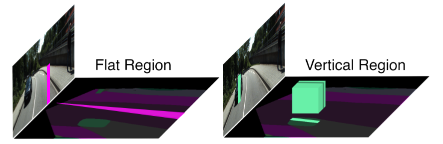
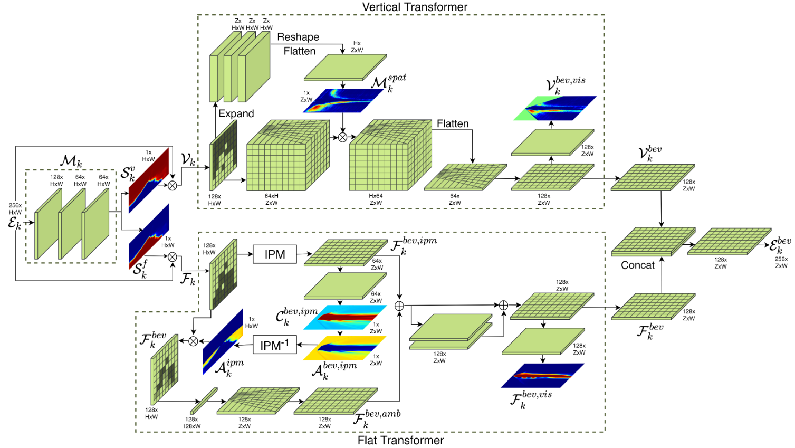

# Bird’s-Eye-View Panoptic Segmentation Using Monocular Frontal View Images
## 整体结构：
骨干网络采用了EfficientDet的修改变体（图中灰色），它以四种不同的尺度$\varepsilon_4$、$\varepsilon_8$、$\varepsilon_{16}$和$\varepsilon_{32}$输出特征图。然后将特征图输入到Dense transformer模块，该模块由两个不同的变换器组成，它们独立地将输入FV图像中的垂直和平坦区域转换为 BEV。然后，Dense transformer将变换后的垂直特征图和平面特征图组合起来，以产生相应的复合BEV特征。随后，转换后的特征图并行输入语义和实例头，然后是全景融合模块，生成最终的BEV全景分割输出\

## Dense Transformer
如下图所示：将图像中不同区域投影到BEV空间中时，是有不同的特点的。对于垂直平坦区域（路面这些），由于平坦区域是完全可观察的，除非被另一个物体遮挡，因此将平坦区域转换为BEV仅涉及使用模型校正透视失真并推断远处区域中的缺失信息。与之相反的，属于垂直区域（车辆，人等具有3d信息的区域）的列需要映射到BEV空间中正交体积区域。作为车辆和人类等 3D 体积对象的投影，垂直区域不是完全可观察的，并且通常缺少维度。例如，由于缺乏与其空间范围有关的信息，因此不能完全观察到汽车。此外，从单目相机捕捉到的它们在世界中的深度也是模棱两可的，这进一步使问题更具挑战性。因此，将垂直非平面对象转换为BEV需要预测其空间位置和其它模型使用数据驱动范式学习到的东西。由于以上特点，针对平坦和垂直区域，需要不同的模块去进行学习（平坦和垂直区域学习的难度和学习的目标有所不同）\

如下图所示，首先，利用连续的2d卷积处理来自backbone不同尺度的特征$\varepsilon_k$分别得到垂直和平坦区域语义mask模块$S^v_k$和$S^f_k$。然后我们计算语义mask和主干特征之间的Hadamard积，以产生垂直和平面特征$V_k$和$F_k$。随后，我们使用各自的transformer将$V_k$和$F_k$独立地转换为它们的BEV表示$V^{bev}_k$和$F^{bev}_k$。然后我们在 BEV 空间中结合这些特征来生成复合BEV特征图 $\varepsilon^{bev}_k$。在训练阶段，使用groundtruth垂直平面掩码监督$S^v_k$和$S^f_k$，从而引导语义mask的学习。

### Vertical Transformer
见上图中上半部分，垂直变换器处理垂直FV特征图Vk，以生成垂直BEV特征Vbev k 。我们首先使用具有 3 × 3 内核的单个 3D 卷积层将 Vk 扩展为 3D 体积晶格。同时，我们为垂直区域生成空间占用掩码 Mk，以估计像素被 BEV 中的垂直元素占用的概率。我们首先使用一系列 2D 卷积将 Vk 中的通道数扩展到深度维度 (Z)，然后沿高度维度将其展平，从而生成此空间占用掩码。然后，我们在体积晶格上广播这个空间占用掩码，以限制 3D 网格中垂直区域的空间范围。随后，我们重塑 3D 体积晶格并使用具有 3×3 内核的 3D 卷积层沿高度维度将其折叠，以在 BEV 空间中生成透视扭曲的垂直特征。我们通过使用 [3] 中提出的方法使用已知的相机内在函数和 BEV 投影分辨率重新采样特征图来纠正垂直 BEV 特征图中的透视失真，该失真从输入 FV 图像的透视投影继承。我们使用具有 3x3 内核的 2D 卷积层进一步处理重采样步骤的输出，以生成最终的垂直 BEV 特征 Vbev k。
### Flat Transformer
见上图中下半部分，我们使用我们的平面转换器模块将平面 FV 特征图 Fk 转换为平面 BEV 特征图 F ipm k 。扁平变压器基于 IPM 算法，该算法通过纠错模块 (ECM) 增强，以解决 IPM 引入的错误。 IPM 算法生成一个不可学习的单应性 M，当它与 FV 特征相乘时，会生成 BEV 中的特征。由于其平面世界假设，IPM 算法仅适用于位于定义的地平面上的特征点。由于根据定义，Fk 仅包含平坦区域，因此使用 IPM 算法将平坦 FV 特征转换为 BEV 会产生可接受的结果。然而，由于 3D 世界中的平坦区域并非完全平坦，因此仅使用 IPM 算法会在 BEV 预测中引入错误。我们使用可学习的 ECM 来解决这些错误，该 ECM 在训练阶段与 IPM 算法一起优化。 ECM 通过估计 IPM 可能出错的区域来工作，并将 ECM 应用于这些区域。为此，我们首先计算 IPM 变换 Cbev,ipm k 的置信度，方法是对 IPM F bev 的输出应用具有 3 × 3 内核的单个 2D 卷积，然后是具有 1×1 内核的通道映射层,ipm k .然后使用等式 Abev,ipm = 1 - Cbev,ipm 计算 IPM 模糊度。 IPM 置信度和模糊度图的示例如图 S.2 所示。我们使用估计的 IPM 单应性的逆，即 M -1 将 IPM 模糊图从 BEV 转换回 BEV。然后，我们将 FV 模糊图与平面 FV 特征相乘，以掩盖高置信度区域，同时仅保留模糊区域。我们还估计 IPM 忽略的平面特征，即主点上方的特征，并将它们添加到 FV 模糊图中，以允许 ECM 也可以在这些区域上运行。然后，我们使用 3 × 3 卷积将这些不明确的平面特征沿高度维度折叠到大小为 B 的瓶颈维度，然后在瓶颈维度进行 2D 卷积以进一步细化折叠的特征。随后，我们使用 2D 卷积沿深度维度扩展瓶颈特征，并使用另一个 2D 卷积进一步细化扩展的特征图。在这里，我们通过使用 [3] 中描述的方法使用已知的相机内在函数重新采样 BEV 特征图中的透视失真，以生成 BEV F bev,amb k 中的模糊度校正特征。然后我们将 F bev,amb k 添加到 IPM F bev,ipm k 的输出中，并使用一个残差块对其进行细化，该残差块由两个具有 3 × 3 内核的 2D 卷积层组成，然后是另一个 2D 卷积层以生成最终平面BEV 特征图 F bev k。

## Semantic and Instance Heads

## Panoptic Fusion Module

## Loss

cite: [paper](http://arxiv.org/abs/2108.03227)

