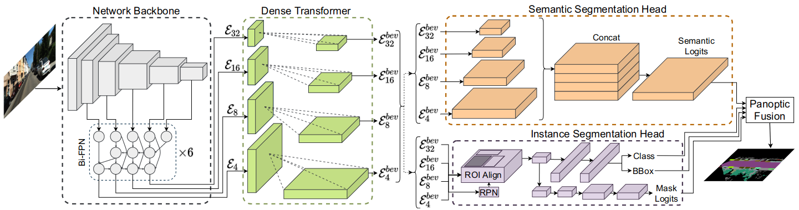

# Bird’s-Eye-View Panoptic Segmentation Using Monocular Frontal View Images
## 整体结构：
骨干网络采用了EfficientDet的修改变体（图中灰色），它以四种不同的尺度 E4、E8、E16 和 E32 输出特征图。然后将特征图输入到Dense transformer模块，该模块由两个不同的变换器组成，它们独立地将输入FV图像中的垂直和平坦区域转换为 BEV。然后，Dense transformer将变换后的垂直特征图和平面特征图组合起来，以产生相应的复合BEV特征。随后，转换后的特征图并行输入语义和实例头，然后是全景融合模块，生成最终的BEV全景分割输出\

cite: [paper](http://arxiv.org/abs/2108.03227)