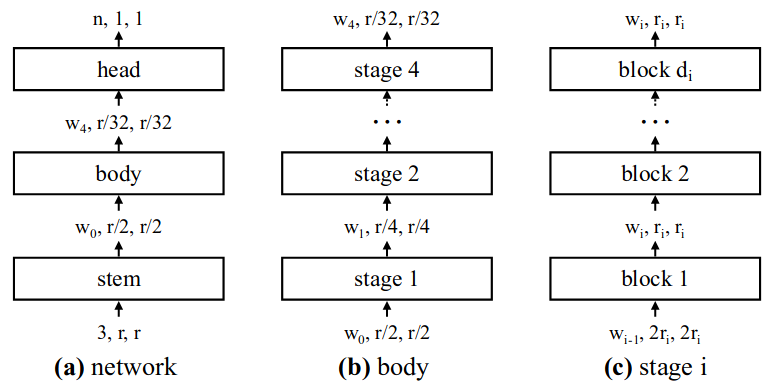

<!-- TOC -->

- [主干网络](#%E4%B8%BB%E5%B9%B2%E7%BD%91%E7%BB%9C)
    - [CSPNetCross Stage Partial Network](#cspnetcross-stage-partial-network)
        - [增强CNN的学习能力](#%E5%A2%9E%E5%BC%BAcnn%E7%9A%84%E5%AD%A6%E4%B9%A0%E8%83%BD%E5%8A%9B)
        - [降低bottlenecks的计算量](#%E9%99%8D%E4%BD%8Ebottlenecks%E7%9A%84%E8%AE%A1%E7%AE%97%E9%87%8F)
        - [降低内存占用](#%E9%99%8D%E4%BD%8E%E5%86%85%E5%AD%98%E5%8D%A0%E7%94%A8)
            - [部分稠密块](#%E9%83%A8%E5%88%86%E7%A8%A0%E5%AF%86%E5%9D%97)
            - [部分过渡层](#%E9%83%A8%E5%88%86%E8%BF%87%E6%B8%A1%E5%B1%82)
    - [RegNetsDesigning Network Design Spaces](#regnetsdesigning-network-design-spaces)
        - [概述：](#%E6%A6%82%E8%BF%B0)
        - [设计空间设计：](#%E8%AE%BE%E8%AE%A1%E7%A9%BA%E9%97%B4%E8%AE%BE%E8%AE%A1)
            - [AnyNetX](#anynetx)
            - [RegNet](#regnet)
- [特征聚合](#%E7%89%B9%E5%BE%81%E8%81%9A%E5%90%88)
    - [FPN系列](#fpn%E7%B3%BB%E5%88%97)
    - [PANet](#panet)
    - [BiFPN](#bifpn)
    - [SFAMScale-wise Feature Aggregation Module](#sfamscale-wise-feature-aggregation-module)
    - [ASFFAdaptively Spatial Feature Fusion](#asffadaptively-spatial-feature-fusion)
- [增强感受野的模块](#%E5%A2%9E%E5%BC%BA%E6%84%9F%E5%8F%97%E9%87%8E%E7%9A%84%E6%A8%A1%E5%9D%97)
    - [SPPspatial pyramid pooling layer](#sppspatial-pyramid-pooling-layer)
    - [ASPPAtrous Spatial Pyramid Pooling](#asppatrous-spatial-pyramid-pooling)
    - [RFBReceptive Field Block](#rfbreceptive-field-block)

<!-- /TOC -->
# 主干网络

## CSPNet(Cross Stage Partial Network)
设计思想：
减少计算量的同时实现更丰富的梯度组合。这个目标是通过将基础层的特征图划分为两部分，然后通过提出的跨阶段层次结构合并它们来实现的。其中最主要概念是通过拆分梯度流使梯度流通过不同的网络路径传播

主要目的：

### 增强CNN的学习能力
现有的CNN在轻量化后精度大大降低，所以希望增强CNN的学习能力，使其在轻量化的同时保持足够的精度。CSPNet 可以很容易地应用于 ResNet、ResNeXt 和 DenseNet。在上述网络上应用CSPNet后，计算量可以减少10%到20%，而且在准确性方面更优

### 降低bottlenecks的计算量
bottlenecks计算量太高会导致完成推理过程需要更多的周期，或者一些计算单元经常空闲。因此，希望能够将CNN中每一层的计算量平均分配，从而有效提升各计算单元的利用率，从而减少不必要的能耗

### 降低内存占用
采用跨通道池化在特征金字塔生成过程中压缩特征图

其结构图如下所示为CSPDenseNet网络：主要由部分稠密块与部分过渡层组成\

#### 部分稠密块
1.增加梯度路径：通过分块归并策略，可以使梯度路径的数量增加一倍。由于采用了跨阶段策略，可以减轻使用显式特征图copy进行拼接所带来的弊端\
2.每一层的平衡计算：通常，DenseNet基础层(图中x0)的通道数远大于生长率。由于在部分稠密块中，参与稠密层操作的基础层通道仅占原始数据的一半，可以有效解决近一半的计算瓶颈\
3.减少内存流量

#### 部分过渡层
部分过渡层的目的是使梯度组合的差异最大。局部过渡层是一种层次化的特征融合机制，它利用梯度流的聚合策略来防止不同的层学习重复的梯度信息，主要由两种方式：如下图所示：\

1.前融合，就是把两部分生成的特征图拼接起来，然后做transition操作。如果采用这种策略，将会重复使用大量的梯度信息。实验结果表明，显着降低计算成本，但 top-1 准确率显着下降了 1.5%\
2.后融合，密集块的输出将通过过渡层，然后与来自第1部分的特征图进行连接。梯度信息由于梯度流被截断，因此不会被重用。实验结果表明，计算成本可以显着下降，但 top-1 准确率仅下降 0.1%

cite: [paper](http://arxiv.org/abs/1911.11929)

## RegNets(Designing Network Design Spaces)
### 概述：
提出了一种新的网络设计范式，目标是帮助促进对网络设计的理解，并发现跨环境通用的设计原则。不是专注于设计单个网络实例(NAS技术主要是从预设的搜索空间，也就是一系列设计规则中搜索到单个最优的网络，而此方法的目的在于找到更好的设计规则，从而可推广到其他网络的设计上)，而是设计参数化网络群体的网络设计空间（找出使得网络性能更优的一些规则，按照这些规则可以构建网络族）
### 设计空间设计：
设计空间是一组可能的模型架构的参数化集合。设计空间设计类似于人工网络设计，但优于人工的设计。在我们流程的每个步骤中，输入是初始设计空间，输出是更简单或更好模型的精细设计空间。通过采样模型和检查它们的误差分布来表征设计空间的质量。例如，在下图中，我们从初始设计空间A开始，然后应用两个细化步骤来生成设计空间B，然后是C。在这种情况下，C ⊆ B ⊆A（左），误差分布从A改进到B再到C（右）

在此论文中,具体来说，在设计过程的每个步骤中，输入是初始设计空间(AnyNet，该空间为不受任何约束的网络结构)，输出是精细设计空间(RegNet,相比与AnyNet在其允许的网络配置的维度和类型方面进行了压缩，不再是无任何限制)，其中每个设计步骤的目的是发现能够产生更简单或性能更好的模型群体的设计原则\
总结一下：（1）我们通过从设计空间中采样和训练 n 个模型来生成模型的分布（2）我们计算并绘制误差 EDF 以总结设计空间质量（3）我们可视化设计空间的各种属性和使用经验引导来获得一些规律（4）最后，我们使用这些规律来改进设计空间。
#### AnyNetX
其整体网络结构如下所示，由stem、body和head部分组成，stem和head固定，body由4个stage构成，每个stage包含$d_i$个block,每个stage的宽度(通道数)为$w_i$\

其中，block的结构如下所示，由残差bottleneck和组卷积构成，其中$g_i$为组卷机的组数，$r_i$为bottleneck收缩率，综上整个设计空间包含16个参数(4个stage，每个stage4个参数：$d_i$，$w_i$，$g_i$，$r_i$)\

#### RegNet
对从AnyNetX空间中采样的模块进行一系列分析，得到RegNet\
其整体趋势是：（1）最佳深度约为20个块（60 层）。这与使用更深的模型用于更高的flops的常见做法形成对比。我们还观察到最佳模型使用 1.0 的瓶颈比率,这有效地消除了瓶颈（在实践中常用）。接下来，我们观察到好的模型的宽度乘数$w_m$约为2.5，与跨阶段加倍宽度的流行配方相似但不完全相同。其余参数（$g_i$、$w_a$、$w_0$）随复杂度增加而增加。（2）我们观察到invert-bottlenexk稍微降低了EDF，并且相对于b = 1 和 g ≥ 1，深depth-wise卷积的性能甚至更差。（3）SE模块是有作用的（4）用activations(所有卷积的输出尺寸)比flops更能表征效率的高低

cite: [paper](http://arxiv.org/abs/2003.13678)

# 特征聚合

## FPN系列
其结构图如下所示：\
\
cite: [paper](http://arxiv.org/abs/1612.03144)

## PANet
其结构图如下所示：\
\
红色虚线箭头表示在FPN算法中，因为要走自底向上的过程，浅层的特征传递到顶层要经过几十甚至一百多个网络层（在FPN中，对应Figure1中那4个蓝色矩形块从下到上分别是ResNet的res2、res3、res4和res5层的输出，层数大概在几十到一百多左右），显然经过这么多层的传递，浅层特征信息丢失会比较厉害。绿色虚线箭头表示作者添加一个bottom-up path augmentation，本身这个结构不到10层，这样浅层特征经过底下原来FPN的lateral connection连接到P2再从P2沿着bottom-up path augmentation传递到顶层，经过的层数就不到10层，能较好地保留浅层特征信息。关于bottom-up path augmentation的具体设计见下图：\
\
cite: [paper](http://arxiv.org/abs/1803.01534)

## BiFPN
其结构图如下所示：\

特点：
1.移除单输入边的结点：因为单输入边的结点没有进行特征融合，故具有的信息比较少，对于最后的融合没有什么贡献度，相反，移除还能减少计算量。
2.权值融合：简单来说，就是针对融合的各个尺度特征增加一个权重，调节每个尺度的贡献度。
3.增加残差链接：意在通过简单的残差操作，增强特征的表示能力。\
cite: [paper](http://arxiv.org/abs/1911.09070)

## SFAM(Scale-wise Feature Aggregation Module)
首先，其整体网络结构如下所示：其中，FFMv2将前一层TUM产生的多级特征图中最大输出特征图和基本特征融合，形成的融合特征图作为下一层TUM的输入，因此可以产生多个不同深度的特征金字塔\

其中SFAM模块对不同级别的特征金字塔进行融合，将金字塔中同尺度的特征图concat起来并利用SE模块进行注意力加权处理，其结构图如下所示：\

cite: [paper](http://arxiv.org/abs/1811.04533)

## ASFF(Adaptively Spatial Feature Fusion)
与以前使用元素累积和或连接来集成多级特征的方法不同，此方法的关键思想是自适应地学习每个尺度的特征图融合的空间权重，它由两个步骤组成：同尺度缩放和自适应融合。如下图所示，对ASFF3模块，有3个学习参数，分别是:$\alpha,\beta,\gamma$,代表了不同尺度特征的权重，图中$X^{1\rightarrow3}$代表第1级特征图缩放到第3级特征图相同尺度后的特征图，依次类推$X^{2\rightarrow3}$代表第2级特征图缩放到第3级特征图相同尺度后的特征图。\

cite: [paper](http://arxiv.org/abs/1911.09516)

# 增强感受野的模块

## SPP(spatial pyramid pooling layer)

cite: [paper](http://arxiv.org/abs/1406.4729)

## ASPP(Atrous Spatial Pyramid Pooling)

cite: [paper](http://arxiv.org/abs/1606.00915)

## RFB(Receptive Field Block)

cite: [paper](http://arxiv.org/abs/1711.07767)