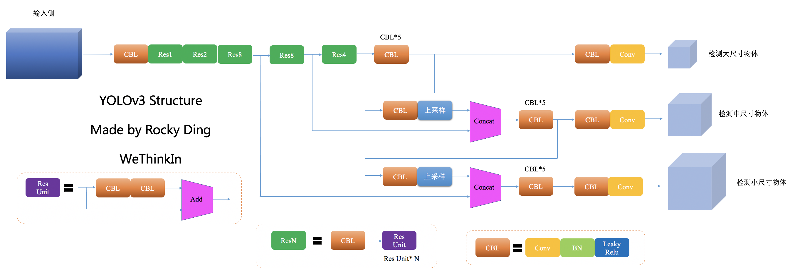
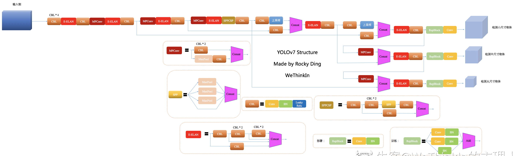

<!-- TOC -->

- [YOLO_V1](#yolo_v1)
    - [Backbone](#backbone)
- [YOLO_V2](#yolo_v2)
    - [Backbone](#backbone)
- [YOLO_V3](#yolo_v3)
    - [Backbone](#backbone)
- [YOLO_V4](#yolo_v4)
    - [Backbone](#backbone)
- [YOLO_V5](#yolo_v5)
    - [Backbone](#backbone)
- [YOLO_X](#yolo_x)
    - [Backbone](#backbone)
- [YOLO_V6](#yolo_v6)
    - [Backbone](#backbone)
- [YOLO_V7](#yolo_v7)
    - [Backbone](#backbone)

<!-- /TOC -->
# YOLO_V1
## Backbone
YOLOv1的backbone结构中使用了Leaky ReLu激活函数，但并没有引入BN层

cite: [paper](https://arxiv.org/pdf/1506.02640.pdf)

# YOLO_V2
## Backbone
Darknet-19网络包含19个卷积层和5个max pooling层，整体计算量比YOLOv1中采用的GooleNet更少，最后用average pooling层代替全连接层进行Inference。
在YOLOv2的Backbone中加入BN层之后，使得mAP提升了2%，而BN层也成为了YOLO后续系列的标配。
\
cite: [paper](https://arxiv.org/abs/1612.08242)

# YOLO_V3
## Backbone
YOLOv3的Backbone在YOLOv2的基础上设计了Darknet-53结构,YOLOv3将YOLOv2的Darknet-19加深了网络层数，并引入了ResNet的残差思想，也正是残差思想让YOLOv3将Backbone深度大幅扩展至Darknet-53。YOLOv3优化了下采样方式（无池化层结构），采用卷积层来实现，而YOLOv2中采用池化层实现。

直观显示如下：

cite: [paper](https://arxiv.org/abs/1804.02767)

# YOLO_V4
目标检测整体结构图：\

## Backbone
YOLOv4的Backbone在YOLOv3的基础上，受CSPNet网络结构启发，将多个CSP子模块进行组合设计成为CSPDarknet53，并且使用了Mish激活函数

cite: [paper](http://arxiv.org/abs/2004.10934)

# YOLO_V5
## Backbone
YOLOv5的Backbone同样使用了YOLOv4中使用的CSP思想

cite: [paper](https://arxiv.org/pdf/1506.02640.pdf)

# YOLO_X
## Backbone
YOLOx的Backbone沿用了YOLOv3的Backbone结构

cite: [paper](https://arxiv.org/pdf/1506.02640.pdf)

# YOLO_V6
## Backbone
YOLOv6的Backbone侧在YOLOv5的基础上，设计了EfficientRep Backbone结构,YOLOv6的Backbone中将普通卷积都替换成了RepConv结构。同时，在RepConv基础上设计了RepBlock结构，其中RepBlock中的第一个RepConv会做channel维度的变换和对齐。另外，YOLOv6将SPPF优化设计为更加高效的SimSPPF，增加特征重用的效率

cite: [paper](https://arxiv.org/pdf/1506.02640.pdf)

# YOLO_V7
## Backbone
YOLOv7的Backbone侧在YOLOv5的基础上，设计了E-ELAN和MPConv结构，E-ELAN结构在下面Neck中详细介绍。MPConv结构由常规卷积与maxpool双路径组成，增加模型对特征的提取融合能力

cite: [paper](https://arxiv.org/pdf/1506.02640.pdf)