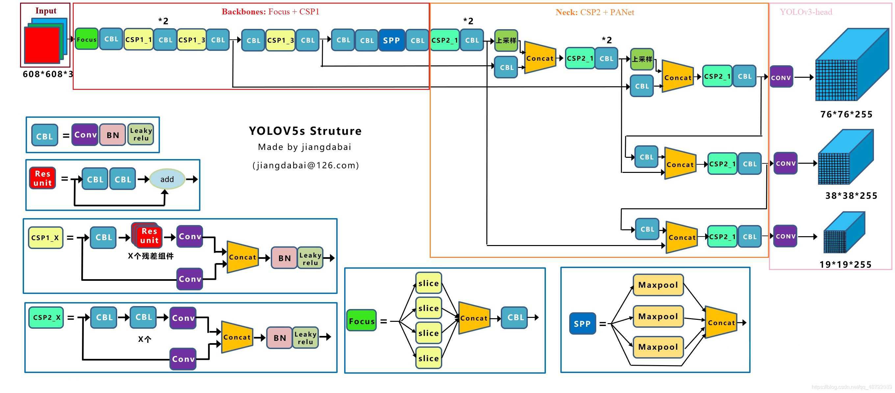

<!-- TOC -->

- [YOLO\_V1](#yolo_v1)
  - [Backbone](#backbone)
  - [Head](#head)
  - [Loss Function](#loss-function)
- [YOLO\_V2](#yolo_v2)
  - [Backbone](#backbone-1)
  - [Head](#head-1)
- [YOLO\_V3](#yolo_v3)
  - [Backbone](#backbone-2)
  - [Neck](#neck)
  - [Head](#head-2)
  - [Loss Function](#loss-function-1)
  - [MMdetection 对应解释](#mmdetection-对应解释)
    - [Backbone darknet53](#backbone-darknet53)
    - [Neck](#neck-1)
- [YOLO\_V4](#yolo_v4)
  - [Backbone](#backbone-3)
  - [Neck](#neck-2)
  - [Head](#head-3)
  - [Loss Function](#loss-function-2)
    - [IOU Loss](#iou-loss)
    - [GIOU Loss](#giou-loss)
    - [DIOU Loss](#diou-loss)
    - [CIOU Loss](#ciou-loss)
- [YOLO\_V5](#yolo_v5)
  - [Backbone](#backbone-4)
  - [Neck](#neck-3)
  - [Head](#head-4)
- [YOLO\_X](#yolo_x)
  - [Backbone](#backbone-5)
  - [Neck](#neck-4)
  - [Head](#head-5)
- [YOLO\_V6](#yolo_v6)
  - [整体结构：](#整体结构)
  - [Backbone](#backbone-6)
  - [Neck](#neck-5)
  - [Head](#head-6)
- [YOLO\_V7](#yolo_v7)
  - [Backbone](#backbone-7)
  - [Neck](#neck-6)
  - [Head](#head-7)

<!-- /TOC -->

<!-- /TOC -->
<!-- /TOC -->
# YOLO_V1
## Backbone
YOLOv1的backbone结构中使用了Leaky ReLu激活函数，但并没有引入BN层

## Head
没有明确的Head层，在网络末端输出一个$7\times7\times30$的
张量，$7\times7$表示把输入图片划分成$7\times7$的网格(在训练时每个网格负责预测中心落在此网格中的物体)，每一个网格的通道维度等于$30=(2\times5+20)$，代表YOLOv1中每个网格能预测2个框，每个框能预测5个参数 (x,y,w,h,C)，分别是bounding box的中心坐标 x,y，bounding box的宽高 w,h 和置信度C。其中C代表网格中box能与物体的取得的最大IOU值，最后再加上20个种类。
## Loss Function
S²表示遍历所有的grid cell，B表示遍历所有的预测框；
对每个有gt的网格位置(也就是gt的中心点所在的grid)，计算预测出来的两个预测框与gt框的iou，较大的那个预测框为正样本，另一个为负样本；
正样本有定位损失、类别损失和置信度损失；负样本只有置信度损失。
正样本的置信度标签值为预测框与标注框(ground truth)的IOU


cite: [paper](https://arxiv.org/pdf/1506.02640.pdf)

# YOLO_V2
## Backbone
Darknet-19网络包含19个卷积层和5个max pooling层，整体计算量比YOLOv1中采用的GooleNet更少，最后用average pooling层代替全连接层进行Inference。
在YOLOv2的Backbone中加入BN层之后，使得mAP提升了2%，而BN层也成为了YOLO后续系列的标配。\

## Head
YOLOv2在YOLOv1的基础上去掉了最后的全连接层，采用了卷积和anchor boxes来预测检测框。由于使用卷积对特征图进行下采样会使很多细粒度特征（Fine-Grained Features）的损失，导致小物体的识别效果不佳。故在YOLOv2Head侧中引入了passthrough layer结构，将特征图一分为四，并进行concat操作，保存了珍贵的细粒度特征。\
YOLOv1中每个网格预测两个检测框，并让最合适的检测框向ground truth框进行回归修正。在YOLOv2中，Head侧不对检测框的宽高进行直接硬回归，而是将检测框与Anchor框的偏差（offset）进行回归，并且每个网格指定 nn 个anchor box。在训练时，只有最接近ground truth的检测框进行损失的计算
cite: [paper](https://arxiv.org/abs/1612.08242)

# YOLO_V3
## Backbone
YOLOv3的Backbone在YOLOv2的基础上设计了Darknet-53结构,YOLOv3将YOLOv2的Darknet-19加深了网络层数，并引入了ResNet的残差思想，也正是残差思想让YOLOv3将Backbone深度大幅扩展至Darknet-53。YOLOv3优化了下采样方式（无池化层结构），采用卷积层来实现，而YOLOv2中采用池化层实现。
\
直观显示如下：

## Neck
采用FPN\
\
## Head
YOLOv3Head侧在YOLOv2的基础上引入了多尺度检测逻辑和多标签分类思想，优化了损失函数,作
YOLOv3在Neck侧的基础上顺势而为融合了3个尺度，在多个尺度的融合特征图上分别独立做检测。再将Anchor Box由5个增加至9个，**每个尺度下分配3个Anchor Box**，最终对于小目标的检测效果提升明显。并且多尺度+9anchor box让YOLOv3的整体检测性能达到了一个比较从容的level。\
YOLOv3将YOLOv2的单标签分类改进为多标签分类，Head侧将用于单标签分类的Softmax分类器改成多个独立的用于多标签分类的Logistic分类器，取消了类别之间的互斥，可以使网络更加灵活，类别数增加到80。YOLOv2使用Softmax分类器，认为一个检测框只属于一个类别，每个检测框分配到概率最大的类别。但实际场景中一个检测框可能含有多个物体或者有重叠的类别标签。Logistic分类器主要用到Sigmoid函数，可以将输入约束在0到1的范围内，当一张图像经过特征提取后的某一检测框类别置信度经过sigmoid函数约束后如果大于设定的阈值，就表示该检测框负责的物体属于该类别。
具体流程：对anchor进行划分，计算每个anchor与所有gt的iou形成iou矩阵(以anchor为行，gt为列)。\
正样本：1.计算每一列iou的最大值(即每个gt与所有anchor的iou的最大值)，这个iou最大值大于0.5的anchor，且anchor对应的grid为gt中心点所在的grid的anchor设为正样本(训练中的真正的正样本是gt与anchor的中心点offset以及anchor的宽高)；2.其余大于0.5的为忽略样本\
负样本：除了正样本和忽略样本，其余都是负样本\
## Loss Function
YOLOv3中置信度误差损失和分类误差损失都使用交叉熵来表示\

cite: [paper](https://arxiv.org/abs/1804.02767)

## MMdetection 对应解释
### Backbone darknet53
```python
class Darknet(BaseModule):
    # Dict(depth: (layers, channels))
    arch_settings = {
        53: ((1, 2, 8, 8, 4), ((32, 64), (64, 128), (128, 256), (256, 512),
                               (512, 1024)))
    }
    def __init__(self,
                 depth=53,
                 out_indices=(3, 4, 5),
                 frozen_stages=-1,
                 conv_cfg=None,
                 norm_cfg=dict(type='BN', requires_grad=True),
                 act_cfg=dict(type='LeakyReLU', negative_slope=0.1),
                 norm_eval=True,
                 pretrained=None,
                 init_cfg=None):
        super(Darknet, self).__init__(init_cfg)
        if depth not in self.arch_settings:
            raise KeyError(f'invalid depth {depth} for darknet')

        self.depth = depth
        self.out_indices = out_indices
        self.frozen_stages = frozen_stages
        self.layers, self.channels = self.arch_settings[depth]

        cfg = dict(conv_cfg=conv_cfg, norm_cfg=norm_cfg, act_cfg=act_cfg)

        self.conv1 = ConvModule(3, 32, 3, padding=1, **cfg)

        self.cr_blocks = ['conv1']
        for i, n_layers in enumerate(self.layers):
            layer_name = f'conv_res_block{i + 1}'
            in_c, out_c = self.channels[i]
            self.add_module(
                layer_name,
                self.make_conv_res_block(in_c, out_c, n_layers, **cfg))
            self.cr_blocks.append(layer_name)

        self.norm_eval = norm_eval

        assert not (init_cfg and pretrained), \
            'init_cfg and pretrained cannot be specified at the same time'
        if isinstance(pretrained, str):
            warnings.warn('DeprecationWarning: pretrained is deprecated, '
                          'please use "init_cfg" instead')
            self.init_cfg = dict(type='Pretrained', checkpoint=pretrained)
        elif pretrained is None:
            if init_cfg is None:
                self.init_cfg = [
                    dict(type='Kaiming', layer='Conv2d'),
                    dict(
                        type='Constant',
                        val=1,
                        layer=['_BatchNorm', 'GroupNorm'])
                ]
        else:
            raise TypeError('pretrained must be a str or None')

    def forward(self, x):
        outs = []
        for i, layer_name in enumerate(self.cr_blocks):
            cr_block = getattr(self, layer_name)
            x = cr_block(x)
            if i in self.out_indices:
                outs.append(x)

        return tuple(outs)
```
先经过一个self.conv1 = ConvModule(3, 32, 3, padding=1, **cfg)提取图像特征；再顺序接5个conv_res_block，每个block的n_layer对应(1, 2, 8, 8, 4)，输入输出通道数对应((32, 64), (64, 128), (128, 256), (256, 512),(512, 1024))

其中conv_res_block由一个常规conv和多个residual模块组成
```python
def make_conv_res_block(in_channels,
                            out_channels,
                            res_repeat,
                            conv_cfg=None,
                            norm_cfg=dict(type='BN', requires_grad=True),
                            act_cfg=dict(type='LeakyReLU',
                            negative_slope=0.1)):

        cfg = dict(conv_cfg=conv_cfg, norm_cfg=norm_cfg, act_cfg=act_cfg)

        model = nn.Sequential()
        model.add_module(
            'conv',
            ConvModule(
                in_channels, out_channels, 3, stride=2, padding=1, **cfg))
        for idx in range(res_repeat):
            model.add_module('res{}'.format(idx),
                             ResBlock(out_channels, **cfg))
        return model

class ResBlock(BaseModule):
    def __init__(self,
                 in_channels,
                 conv_cfg=None,
                 norm_cfg=dict(type='BN', requires_grad=True),
                 act_cfg=dict(type='LeakyReLU', negative_slope=0.1),
                 init_cfg=None):
        super(ResBlock, self).__init__(init_cfg)
        assert in_channels % 2 == 0  # ensure the in_channels is even
        half_in_channels = in_channels // 2

        # shortcut
        cfg = dict(conv_cfg=conv_cfg, norm_cfg=norm_cfg, act_cfg=act_cfg)

        self.conv1 = ConvModule(in_channels, half_in_channels, 1, **cfg)
        self.conv2 = ConvModule(
            half_in_channels, in_channels, 3, padding=1, **cfg)

    def forward(self, x):
        residual = x
        out = self.conv1(x)
        out = self.conv2(out)
        out = out + residual

        return out
```
out_indices=(3, 4, 5)指第3，4，5个block的输出会输入到neck中，那么对应的通道数就是（256，512，1024）了,对应大小分别是n/8,n/16,n/32

### Neck
```python
config:
neck=dict(
        type='YOLOV3Neck',
        num_scales=3,
        in_channels=[1024, 512, 256],
        out_channels=[512, 256, 128]),
code:
class YOLOV3Neck(BaseModule):
    def __init__(self,
                 num_scales: int,
                 in_channels: List[int],
                 out_channels: List[int],
                 conv_cfg: OptConfigType = None,
                 norm_cfg: ConfigType = dict(type='BN', requires_grad=True),
                 act_cfg: ConfigType = dict(
                     type='LeakyReLU', negative_slope=0.1),
                 init_cfg: OptMultiConfig = None) -> None:
        super(YOLOV3Neck, self).__init__(init_cfg)
        assert (num_scales == len(in_channels) == len(out_channels))
        self.num_scales = num_scales
        self.in_channels = in_channels
        self.out_channels = out_channels

        # shortcut
        cfg = dict(conv_cfg=conv_cfg, norm_cfg=norm_cfg, act_cfg=act_cfg)

        # To support arbitrary scales, the code looks awful, but it works.
        # Better solution is welcomed.
        self.detect1 = DetectionBlock(in_channels[0], out_channels[0], **cfg)
        for i in range(1, self.num_scales):
            in_c, out_c = self.in_channels[i], self.out_channels[i]
            inter_c = out_channels[i - 1]
            self.add_module(f'conv{i}', ConvModule(inter_c, out_c, 1, **cfg))
            # in_c + out_c : High-lvl feats will be cat with low-lvl feats
            self.add_module(f'detect{i+1}',
                            DetectionBlock(in_c + out_c, out_c, **cfg))

    def forward(self, feats=Tuple[Tensor]) -> Tuple[Tensor]:
        assert len(feats) == self.num_scales

        # processed from bottom (high-lvl) to top (low-lvl)
        outs = []
        out = self.detect1(feats[-1])
        outs.append(out)

        for i, x in enumerate(reversed(feats[:-1])):
            conv = getattr(self, f'conv{i+1}')
            tmp = conv(out)

            # Cat with low-lvl feats
            tmp = F.interpolate(tmp, scale_factor=2)
            tmp = torch.cat((tmp, x), 1)

            detect = getattr(self, f'detect{i+2}')
            out = detect(tmp)
            outs.append(out)

        return tuple(outs)

class DetectionBlock(BaseModule):
    def __init__(self,
                 in_channels: int,
                 out_channels: int,
                 conv_cfg: OptConfigType = None,
                 norm_cfg: ConfigType = dict(type='BN', requires_grad=True),
                 act_cfg: ConfigType = dict(
                     type='LeakyReLU', negative_slope=0.1),
                 init_cfg: OptMultiConfig = None) -> None:
        super(DetectionBlock, self).__init__(init_cfg)
        double_out_channels = out_channels * 2

        # shortcut
        cfg = dict(conv_cfg=conv_cfg, norm_cfg=norm_cfg, act_cfg=act_cfg)
        self.conv1 = ConvModule(in_channels, out_channels, 1, **cfg)
        self.conv2 = ConvModule(
            out_channels, double_out_channels, 3, padding=1, **cfg)
        self.conv3 = ConvModule(double_out_channels, out_channels, 1, **cfg)
        self.conv4 = ConvModule(
            out_channels, double_out_channels, 3, padding=1, **cfg)
        self.conv5 = ConvModule(double_out_channels, out_channels, 1, **cfg)

    def forward(self, x: Tensor) -> Tensor:
        tmp = self.conv1(x)
        tmp = self.conv2(tmp)
        tmp = self.conv3(tmp)
        tmp = self.conv4(tmp)
        out = self.conv5(tmp)
        return out
```
示意图：

# YOLO_V4
目标检测整体结构图：\

## Backbone
YOLOv4的Backbone在YOLOv3的基础上，受CSPNet网络结构启发，将多个CSP子模块进行组合设计成为CSPDarknet53，并且使用了Mish激活函数($f(x)=x \cdot tanh(ln(1+e^x))$),该激活函数有以下几个优点：\
1.无上界有下界。Mish向上无边界避免了由于封顶而导致的梯度饱和，加快训练过程。向下有边界有助于实现强正则化效果。
2.非单调函数。允许其在负半轴有稳定的微小负值，从而使梯度流更稳定。与ReLU负半轴的硬零边界相比，其梯度更平滑。
3.无穷连续性与光滑性。具有较好的泛化能力，提高训练结果的质量。

## Neck
主要包含了SPP模块和PAN模块(从add操作改为concat操作)\

## Head
YOLOv4的Head侧沿用了YOLOv3的整体架构，并引入了CIOU Loss和DIOU NMS来提升Head侧的整体性能
## Loss Function
在YOLOv3中，使用MSE(均方误差）损失函数对检测框的中心点以及宽高坐标进行优化。在MSE损失函数的逻辑中，将检测框的中心点和宽高坐标作为独立的变量对待，但是实际上他们之间是有关联的。所以一个直观的解决方案是使用IOU损失代替MSE损失。\
简单对IOU损失函数做个总结：\
### IOU Loss
$$L_{IOU}=1-IOU(A,B)=1-\frac{A \cap B}{A \cup B}$$
IOU Loss思想简洁明了，但存在两个问题：
1.当检测框和ground truth不相交时，会使IOU=0，从而无法反应两个框距离的远近，进而导致IOU Loss不可导。
2.当两个检测框大小相同，IOU也相同时，IOU Loss无法区分两者位置的差异
### GIOU Loss
$$L_{GOU}=1-GIOU=1-IOU(A,B)+\frac{C-A \cup B}{C}$$
其中，C代表A和B的最小外接矩形，可以解决IOUloss的第一个问题，但是当检测框在gt内部，且检测框大小相同时也同样无法区分两者位置的差异
### DIOU Loss
$$L_{DIOU}=1-IOU(A,B)+\frac{\rho(A,B)^2}{c^2}$$
其中$\rho(A,B)$代表A,B框中心点距离，c代表A,B框最下外接矩形的对角线距离，但当检测框在gt内部，中心位置相同，面积相同，但长宽比不同时，会得到相同的loss值，也就是对这种检测框的长宽比学习能力不够强。
### CIOU Loss
CIOU Loss在DIOU Loss的基础上考虑了检测框长宽比的因素，将检测框回归损失的三大逻辑：重叠面积、中心点距离，长宽比进行了有效整合
$$L_{CIOU}=1-IOU(A,B)+\frac{\rho(A,B)^2}{c^2}+\alpha v$$
其中，$v$用来度量宽高比的一致性,$\alpha$为系数函数
$$v=\frac{4}{\pi_2}(arctan\frac{w^{gt}}{h^{gt}}-arctan\frac{w}{h})^2$$
$$\alpha=\frac{v}{(1-IOU)+v}$$
YOLOv4改进了YOLOv1-v3中使用的传统NMS操作，使用了DIOU思想计算“IOU”值，进一步优化了后处理效果。CIOU思想在训练中有很大作用，但是在Inference过程中，并没有ground truth的信息，所以使用DIOU足矣，且能减少计算量
cite: [paper](http://arxiv.org/abs/2004.10934)

# YOLO_V5
## Backbone
YOLOv5的Backbone同样使用了YOLOv4中使用的CSP思想

YOLOv5最初版本中会存在Focus结构(结构见下图，作用是在没有信息丢失情况下的二倍下采样特征图)，在YOLOv5第六版开始后，就舍弃了这个结构改用6*6，stride＝2的常规卷积，其产生的参数更少，效果更好

## Neck
YOLOv5的Neck侧也使用了SPP模块和PAN模块，但是在PAN模块进行融合后，将YOLOv4中使用的常规CBL模块替换成借鉴CSPnet设计的CSP_v5结构，加强网络特征融合的能力\

## Head
YOLOv5的Head侧在YOLOv4的基础上引入了Auto Learning Bounding Box Anchors（自适应anchor box）和邻域正负样本分配策略\
由于增加高质量正样本检测框可以显著加速收敛，故YOLOv5设计了相应的邻域正负样本分配策略，其主要流程如下：
将ground truth与当前feature map中的anchor box进行比较，如果ground truth与anchor box的宽高比例都处在 $[\frac{1}{4},4]$，那么这个ground truth就能与当前featuer map相匹配。
将当前feature map中的ground truth分配给对应的grid cell。将这个grid cell分为四个象限，针对与当前feature map匹配的ground truth，会计算该ground truth处于四个象限中的哪一个，并将邻近的两个grid cell中的检测框也作为正样本。如下图所示，若ground truth偏向于右上角的象限，就会将ground truth所在grid cell的上面和右边的grid cell中的检测框也作为正样本。

比起yolov4中一个ground truth只能匹配一个正样本，YOLOv5能够在多个grid cell中都分配到正样本，有助于训练加速和正负样本平衡
cite: [github](https://github.com/ultralytics/yolov5)

# YOLO_X
## Backbone
YOLOx的Backbone沿用了YOLOv3的Backbone结构

## Neck
使用了PAN，并且使用了SPP模块。\

## Head
YOLOx的Head侧在YOLOv5的基础上在网络结构中引入了Decoupled Head，并使用anchor-free思想和SimOTA正负样本分配策略进行损失函数的计算与优化。\
YOLOx使用了三个Decoupled Head（解耦头），分别学习cls（分类信息），reg（检测框信息）和IOU（置信度信息）。常规的检测头在特征的表达与学习能力上比起Decoupled Head有所欠缺，并且Decoupled Head模块能加快模型的收敛速度\


除此之外，YOLOx还使用anchor-free思想，比起YOLO系列中常规的anchor-based，在Head侧可以减少约$\frac{2}{3}$ 
的参数。比起anchor-based方法使用先验知识设计anchor尺寸，anchor-free思想将感受野作为“anchor”信息。上述三个Decoupled Head中最上面的分支对应着大anchor框，中间的分支对应着中等anchor框最下面的分支对应着小anchor框。最后的输出将这个三个分支融合成一个 85×8400×8400的特征向量\

实际上是将anchor大小的信息融入到了解码头输出的尺寸中,并且每个grid处有一个anchor;举例来说,如下图所示输出最大的特征图为128*80*80,经过Decoupled Head后,pred_box分支为80*80*4,而此层的下采样倍数为32,相当于在将输入图片以32个像素划分为80*80个grid,每个grid预测一个box(因为特征图是80*80*4)，而每个grid的实际的大小就可以看做当前grid的一个anchor。所以这里的anchor free其实就是anchor数量为1，大小等于grid的特殊情况


接下来就是介绍YOLOx的正负样本分配策略了，我们知道目标检测场景一张图像中往往负样本占绝大多数，而正样本只是少数。为了获得更多高质量的正样本，YOLOx中设计了样本初筛+SimOTA逻辑。

在样本初筛中，有两种方法来筛选正样本：

1.根据中心点判断：找到中心点落在ground truth框中的所有anchor box。
2.根据检测框判断：以ground truth中心点作为基准，绘制一个边长为5的正方形，找到中心点落地这个正方形中的所有anchor box。

经过初筛之后，再使用SimOTA进行精细化筛选。其主要流程如下：
1.通过上面提到的样本初筛方法，获取正样本，同时获取它们的特征信息（cls，reg，IOu）。
2.计算正样本与ground truth的Reg Loss和Cls Loss，并将它们加权相加，Reg和Cls的权重为 3:13:1。（loss aware）
3.通过每个ground truth的检测样本来确定其能分配到的高价值正样本数（Dynamic K），其逻辑是获取与当前ground truth的IOU值前10的检测框，并将它们求和并取整，计算出来的整数就作为当前ground truth的正样本数“容量”。
4.确定每个ground truth的Dynamic K个正样本，其逻辑是选取步骤2中加权Loss最小的前K个样本作为正样本。
5.共用正样本去重，其逻辑是如果一个检测框被两个及以上的ground truth认作正样本，那么再次使用加权Loss进行评判，将这个检测框分给加权Loss最小的那个ground truth，作为其独有的正样本。


YOLOv5的正负样本分配策略是基于邻域匹配，并通过跨网格匹配策略增加正样本数量，从而使得网络快速收敛，但是该方法属于静态分配方法，并不会随着网络训练的过程而调整。YOLOx使用的SimOTA能够算法动态分配正样本，进一步提高检测精度。而且比起OTA由于使用了Sinkhorn-Knopp算法导致训练时间加长，SimOTA算法使用Top-K近似策略来得到样本最佳匹配，大大加快了训练速度\
cite: [paper](http://arxiv.org/abs/2107.08430)

# YOLO_V6
## 整体结构：

## Backbone
YOLOv6的Backbone侧在YOLOv5的基础上，设计了EfficientRep Backbone结构,YOLOv6的Backbone中将普通卷积都替换成了RepConv结构。同时，在RepConv基础上设计了RepBlock和CSPStackRep结构。另外，YOLOv6将SPPF优化设计为更加高效的SimSPPF，增加特征重用的效率

在小型网络中使用RepBlock，大型网络中使用CSPStackRep，其中RepBlock与CSPStackRep如下图所示：(a)为RepBlock训练时的结构，由N个RepVGG堆叠而来；(b)为RepBlock推理时的结构；(c)为CSPStackRep\

## Neck
YOLOv6的Neck侧受到硬件感知神经网络设计思想的启发，基于RepVGG style设计了可重参数化、更高效的Rep-PAN。Rep-PAN实际上是在PAN模块基础上，引入RepVGG style的RepBlock替换了YOLOv5中使用的CSP-Block

## Head
YOLOv6的Head侧和YOLOx一样使用Anchor-free逻辑和SimOTA标签分配策略，并在其基础上改进了Decoupled Head（解耦检测头）结构，在损失函数中引入了SIoU边界框回归损失

YOLOv6依然采用了Decoupled Head结构，并对其进行了精简设计。YOLOX的检测头虽然提升了检测精度，但一定程度上增加了网络延时。YOLOv6采用Hybrid Channels策略重新设计了一个更高效的Decoupled Head结构，在维持精度的同时降低了延时，缓解了Decoupled Head中 3\times 33×3 卷积带来的额外延时开销

为了进一步提升回归精度，YOLOv6使用了SIoU检测框回归损失函数来优化网络的学习过程。

YOLOv4中的CIoU Loss虽然考虑到检测框与ground truth之间的重叠面积、中心点距离，长宽比这三大因素，但是依然缺少了对检测框与ground truth之间方向的匹配性的考虑。SIoU Loss通过引入了所需回归之间的向量角度，重新定义了距离损失，有效降低了回归的自由度，加快网络收敛，进一步提升了回归精度。
cite: [paper](http://arxiv.org/abs/2209.02976)

# YOLO_V7
## Backbone
YOLOv7的Backbone在YOLOv5的基础上，设计了E-ELAN和MPConv结构，E-ELAN结构在下面Neck中详细介绍。MPConv结构由常规卷积与maxpool双路径组成，增加模型对特征的提取融合能力

## Neck
YOLOv7的Neck侧主要包含了SPPSCP模块和优化的PAN模块，SPPCSP模块在SPP模块基础上在最后增加concat操作，与SPP模块之前的特征图进行融合，更加丰富了特征信息。PAN模块引入E-ELAN结构，使用expand、shuffle、merge cardinality等策略实现在不破坏原始梯度路径的情况下，提高网络的学习能力

## Head
YOLOv7的Head侧使用了和YOLOv5一样的损失函数，引入RepVGG style改造了Head网络结构，并使用了辅助头（auxiliary Head）训练以及相应的正负样本匹配策略


YOLOv7在Head侧引入了辅助头（auxiliary Head）进行训练。正常网络训练如上图（a）所示，而用辅助头参与训练时，将对模型的训练进行深度监督，如上图（b）所示。将辅助头和检测头的损失进行融合，相当于在网络高层进行局部的模型ensemble操作，提升模型的整体性能。

而YOLOv7的正负样本分配策略正是围绕着检测头（lead head）与auxiliary Head进行设计，其主要是将YOLOv5和YOLOx的正负样本分配策略相结合：

1.使用YOLOv5的正负样本分配策略分配正样本。
2.使用YOLOx的正负样本分配策略确定正样本。

YOLOv7的正负样本分配策略相较于yolov5，加入了loss aware，利用当前模型的表现，能够实时精筛；而较于只使用YOLOX中的SimOTA算法，能够提供更精确的先验知识。


上图（d）中，lead head和auxiliary head使用一样的正负样本匹配策略，通过让浅层的auxiliary head学习到lead head已经获得的特征，让lead head更能专注于学习尚未学习到的剩余特征。

而上图（e）中，在使用lead head和auxiliary head一起优化模型的时候，auxiliary head的正样本是较为“粗糙的“，主要是通过放宽正样本分配过程的约束来获得更多的正样本。lead head中的一个anchor如果匹配上ground truth，则分配3个正样本，而同样的情况下auxiliary head分配5个。lead head中将top10个样本IOU求和取整，而auxiliary head中取top20。auxiliary head的学习能力不如lead head强，为了避免丢失需要学习的信息，将重点优化auxiliary head的召回率。而lead head可以从高recall的结果中筛选出高精度的结果作为最终输出。lead head和auxiliary head的损失函数权重设置为 4:14:1。

cite: [paper](http://arxiv.org/abs/2207.02696)
