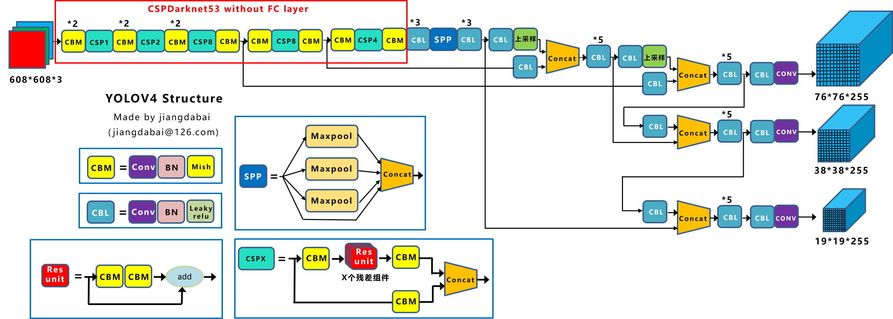

<!-- TOC -->

- [YOLO_V1](#yolo_v1)
  - [Backbone](#backbone)
  - [Head](#head)
  - [Loss Function](#loss-function)
- [YOLO_V2](#yolo_v2)
  - [Backbone](#backbone-1)
  - [Head](#head-1)
- [YOLO_V3](#yolo_v3)
  - [Backbone](#backbone-2)
  - [Neck](#neck)
  - [Head](#head-2)
- [YOLO_V4](#yolo_v4)
  - [Backbone](#backbone-3)
  - [Neck](#neck-1)
  - [Head](#head-3)
- [YOLO_V5](#yolo_v5)
  - [Backbone](#backbone-4)
  - [Neck](#neck-2)
  - [Head](#head-4)
- [YOLO_X](#yolo_x)
  - [Backbone](#backbone-5)
  - [Neck](#neck-3)
  - [Head](#head-5)
- [YOLO_V6](#yolo_v6)
  - [整体结构：](#整体结构)
  - [Backbone](#backbone-6)
  - [Neck](#neck-4)
  - [Head](#head-6)
- [YOLO_V7](#yolo_v7)
  - [Backbone](#backbone-7)
  - [Neck](#neck-5)
  - [Head](#head-7)

<!-- /TOC -->
# YOLO_V1
## Backbone
YOLOv1的backbone结构中使用了Leaky ReLu激活函数，但并没有引入BN层

## Head
没有明确的Head层，在网络末端输出一个$7\times7\times30$的
张量，$7\times7$表示把输入图片划分成$7\times7$的网格(在训练时每个网格负责预测中心落在此网格中的物体)，每一个网格的通道维度等于$30=(2\times5+20)$，代表YOLOv1中每个网格能预测2个框，每个框能预测5个参数 (x,y,w,h,C)，分别是bounding box的中心坐标 x,y，bounding box的宽高 w,h 和置信度C。其中C代表网格中box能与物体的取得的最大IOU值，最后再加上20个种类。
## Loss Function
S²表示遍历所有的grid cell，B表示遍历所有的预测框；
对每个有gt的网格位置(也就是gt的中心点所在的grid)，计算预测出来的两个预测框与gt框的iou，较大的那个预测框为正样本，另一个为负样本；
正样本有定位损失、类别损失和置信度损失；负样本只有置信度损失。
正样本的置信度标签值为预测框与标注框(ground truth)的IOU

cite: [paper](https://arxiv.org/pdf/1506.02640.pdf)

# YOLO_V2
## Backbone
Darknet-19网络包含19个卷积层和5个max pooling层，整体计算量比YOLOv1中采用的GooleNet更少，最后用average pooling层代替全连接层进行Inference。
在YOLOv2的Backbone中加入BN层之后，使得mAP提升了2%，而BN层也成为了YOLO后续系列的标配。\
\
## Head

cite: [paper](https://arxiv.org/abs/1612.08242)

# YOLO_V3
## Backbone
YOLOv3的Backbone在YOLOv2的基础上设计了Darknet-53结构,YOLOv3将YOLOv2的Darknet-19加深了网络层数，并引入了ResNet的残差思想，也正是残差思想让YOLOv3将Backbone深度大幅扩展至Darknet-53。YOLOv3优化了下采样方式（无池化层结构），采用卷积层来实现，而YOLOv2中采用池化层实现。
\
直观显示如下：

## Neck
采用FPN\
\
## Head

cite: [paper](https://arxiv.org/abs/1804.02767)

# YOLO_V4
目标检测整体结构图：\

## Backbone
YOLOv4的Backbone在YOLOv3的基础上，受CSPNet网络结构启发，将多个CSP子模块进行组合设计成为CSPDarknet53，并且使用了Mish激活函数($f(x)=x \cdot tanh(ln(1+e^x))$),该激活函数有以下几个优点：\
1.无上界有下界。Mish向上无边界避免了由于封顶而导致的梯度饱和，加快训练过程。向下有边界有助于实现强正则化效果。
2.非单调函数。允许其在负半轴有稳定的微小负值，从而使梯度流更稳定。与ReLU负半轴的硬零边界相比，其梯度更平滑。
3.无穷连续性与光滑性。具有较好的泛化能力，提高训练结果的质量。

## Neck
主要包含了SPP模块和PAN模块(从add操作改为concat操作)\
\
## Head

cite: [paper](http://arxiv.org/abs/2004.10934)

# YOLO_V5
## Backbone
YOLOv5的Backbone同样使用了YOLOv4中使用的CSP思想

YOLOv5最初版本中会存在Focus结构(结构见下图，作用是在没有信息丢失情况下的二倍下采样特征图)，在YOLOv5第六版开始后，就舍弃了这个结构改用6*6，stride＝2的常规卷积，其产生的参数更少，效果更好

## Neck
YOLOv5的Neck侧也使用了SPP模块和PAN模块，但是在PAN模块进行融合后，将YOLOv4中使用的常规CBL模块替换成借鉴CSPnet设计的CSP_v5结构，加强网络特征融合的能力\
\
## Head

cite: [github](https://github.com/ultralytics/yolov5)

# YOLO_X
## Backbone
YOLOx的Backbone沿用了YOLOv3的Backbone结构

## Neck
使用了YOLOv3的结构(FPN)，并且使用了SPP模块。\

## Head

cite: [paper](http://arxiv.org/abs/2107.08430)

# YOLO_V6
## 整体结构：

## Backbone
YOLOv6的Backbone侧在YOLOv5的基础上，设计了EfficientRep Backbone结构,YOLOv6的Backbone中将普通卷积都替换成了RepConv结构。同时，在RepConv基础上设计了RepBlock和CSPStackRep结构。另外，YOLOv6将SPPF优化设计为更加高效的SimSPPF，增加特征重用的效率

在小型网络中使用RepBlock，大型网络中使用CSPStackRep，其中RepBlock与CSPStackRep如下图所示：(a)为RepBlock训练时的结构，由N个RepVGG堆叠而来；(b)为RepBlock推理时的结构；(c)为CSPStackRep\

## Neck
YOLOv6的Neck侧受到硬件感知神经网络设计思想的启发，基于RepVGG style设计了可重参数化、更高效的Rep-PAN。Rep-PAN实际上是在PAN模块基础上，引入RepVGG style的RepBlock替换了YOLOv5中使用的CSP-Block

## Head

cite: [paper](http://arxiv.org/abs/2209.02976)

# YOLO_V7
## Backbone
YOLOv7的Backbone在YOLOv5的基础上，设计了E-ELAN和MPConv结构，E-ELAN结构在下面Neck中详细介绍。MPConv结构由常规卷积与maxpool双路径组成，增加模型对特征的提取融合能力

## Neck
YOLOv7的Neck侧主要包含了SPPSCP模块和优化的PAN模块，SPPCSP模块在SPP模块基础上在最后增加concat操作，与SPP模块之前的特征图进行融合，更加丰富了特征信息。PAN模块引入E-ELAN结构，使用expand、shuffle、merge cardinality等策略实现在不破坏原始梯度路径的情况下，提高网络的学习能力

## Head

cite: [paper](http://arxiv.org/abs/2207.02696)
